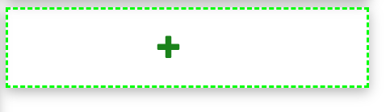

### arcade拖拽页面测试用例。

​	1. 刷新按钮 

​		success: 页面随机刷新一条数据。 并且其他用户没有在看的数据。页面ProductCluster key 变化。

```sql
  select
       distinct  ecom_item_key,manaual_check_pre,master_item_key,master_item_name,item_name,web_url,local_url,ecom_item_url,master_item_url,batch_date,gcp_pic_file
        from side_door_data_prepare_v2 where master_item_key =(
 select master_item_key from (
     SELECT master_item_key,RAND() as r FROM  side_door_data_prepare_v2
     where batch_date=(select max(batch_date) from side_door_data_prepare_v2) and  master_item_key not in ( select master_item_key from master_item_manage_complete where batch_date =(select max(batch_date) from side_door_data_prepare_v2))
        <if test="list != null and list.size()>0">
            and  master_item_key not in
            <foreach item="item" index="index" collection="list"
                     open="(" separator="," close=")">
                #{item}
            </foreach>
        </if>

     ORDER BY r LIMIT 1) as t1) and batch_date=(select max(batch_date) from side_door_data_prepare_v2)
```

2. 新增newProduct  

   Success :

   -  新增一个框 

   - 点击红色的可以删除此框。输入框可以编辑。

   - 没有更新商品名，输入框为黄色。标识颜色为深黄色，表示没有经过更新商品名。

   

3. updateName 

   success: 

   - 新增记录到数据库对应的表。master_item_manage_update_name生成一条记录
   - 输入框颜色变成绿色。左边标志颜色变成深绿，表示此商品做过商品名更新。

4.  图片展示框

   Success ：

   - 当图片大于四个。增加	缩放按钮。小于四个，隐藏缩放按钮。
   - 缩放按钮点击展示四个图片或者所有图片。	对应按钮变化。

5. 拖拽。

   ​	Success :

    1. MasterItemKey:  20101000007369   to  	 MasterItemKey:  2010100000736344  (聚类过的相互拖拽)

       

   	2.  MasterItemKey:  20101000007369    to   new        （聚类过的拖动至 new）

   	3.  MasterItemKey:  20101000007369    to   newCheck_0

   	4.  new    to   MasterItemKey:  20101000007369    (新到旧)

   	5.  new to  newCheck_0 

   	6.  newCheck_0  to new 

   	7.  NewCheck_0 to  NewCheck_1。

        

        - 数据库生成对应的记录。master_item_opreate。（拖动到new不生成对应的记录）
        - 拖动到 newCheck_0 ，根据商品个数有无隐藏显示删除按钮 

        - 拖动到new。new框中图片缩小
        - new 中拖出来，图片变大。

   

5. 删除按钮。

   Success :  

   1. 拖动至删除按钮.。删除图片，数据库master_item_opreate生成记录
   2. 点击删除按钮。出现垃圾桶商品。
   3. 双击垃圾桶中的商品。商品重新被回收到new。

6. 完成按钮。  ******重要**

   Success:

   	1. 用户操作的最近的数据记录写入neo4j。
   	2. 如果new框中有商品。提示信息。不给下一步。
   	3. 没有更新商品名。不给继续下一步。提示没有更新的商品
   	4. 存在没有数据的新增的框。不给继续下一步。