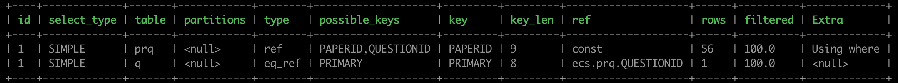
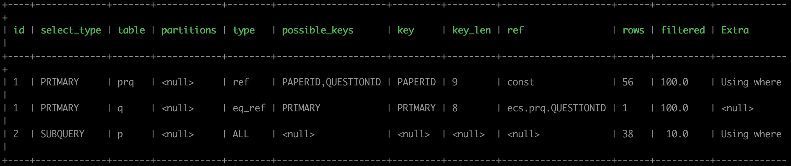
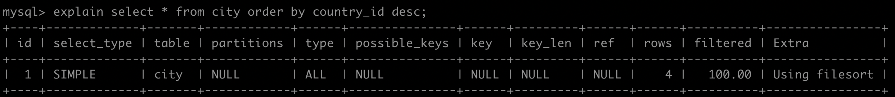
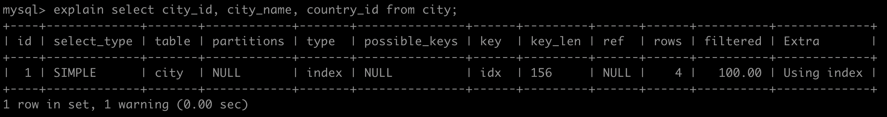

5月30日面试

## 一、Java基础相关面试题

### 1. String类为什么使用final修饰？

> - 为了效率：String类是最常用的类之一，为了效率禁止被继承和重写。
> - 为了安全：String类中有很多调用底层的本地方法，调用了操作系统的API，如果方法可以被重写可能会被植入恶意代码破坏程序。

##  二、springboot相关面试题

### 1. Springboot特性

> - 使开发者快速搭建Spring环境
> - 提供一系列开箱即用的starter
> - 提供了许多非业务性的功能，如tomcat、jetty
> - 没有XML配置，没有代码生成

## 三、MySQL相关面试题

### 1. 索引

#### 1.1 索引概述

索引就是帮助MySQL高效获取数据的数据结构（有序）。在数据之外，数据系统还维护着满足特定查找算法的数据结构，这些数据结构以某种方式引用（指向）数据，这样就可以在这些数据结构上实现高级查找算法。

#### 1.2 索引优劣势

##### 优势

​		1) 提高数据检索效率，降低数据库的IO成本；

​		2) 通过索引对数据进行排序，降低数据排序的成本，降低CPU的消耗。

##### 劣势

​		1) 实际上索引也是一张表，该表保存了主键和索引字段，并指向实体类的记录，所以索引列也是要占用空间的；

​		2) 虽然索引大大提高了查询的效率，但同时也降低了更新表的速度(insert、update、delete)。因为每次更新不仅要更新表数据。

#### 1.3 索引结构

| 索引          | InnoDB引擎      | MylSAM引擎 | Memory引擎 |
| ------------- | --------------- | ---------- | ---------- |
| BTREE索引     | 支持            | 支持       | 支持       |
| HASH索引      | 不支持          | 不支持     | 支持       |
| R-tree索引    | 不支持          | 支持       | 不支持     |
| Full-text索引 | 5.6版本之后支持 | 支持       | 不支持     |

**InnoDB存储引擎**总支持事务处理、支持外键、支持崩溃修复能力和并发控制。另外总支持AUTO_INCREMENT，自增列必须为主键、自动增长列的值不能为空且必须唯一。但读写效率差，占用的数据空间相对比较大。

**MylSAM引擎**插入数据快，空间和内存使用比较低。缺点是不支持事务的完整性和并发性。

**Memory引擎**所有的数据都在内存中，数据的处理速度快，但安全性不高，它对表的大小有要求，不能建立太大的表。如果内存出现异常就会影响到数据，如果重启或者关机，数据都会消失。

##### 1.3.1 BTREE结构

BTree又叫多路平衡搜索树，一颗m叉的BTree特性如下：

- 树中每个节点最多包含m个孩子。

- 除根节点与叶子节点外，每个节点至少有[ceil(m/2)]个孩子。

- 若根节点不是叶子结点，则至少有两个孩子。

- 所有的叶子结点都在同一层。

- 每个非叶子结点由n个key与n+1个指针组成，其中[ceil(m/2)-1]<=n<=m-1

  BTree树和二叉树相比，查询数据的效率更高，	因为对于相同的数据量来说，BTree的层级结构比二叉树的小，因此搜索速度快。

##### 1.3.2 B+Tree

B+Tree为BTree的变种，B+Tree与BTree的区别为：

- n叉B+Tree最多含有n个key，而BTree最多含有n-1个key。
- B+Tree的叶子节点保存所有的key信息，依key大小进行排列。
- 所有的非叶子结点都可以看做是key的索引部分。

#### 1.4 索引分类

> 单值索引：即一个索引只包含单个列，一个表可以有多个单列索引。
>
> 唯一索引：索引列的值必须唯一，但允许有空值。
>
> 复合索引：即一个索引包含多个列。 

#### 1.5 索引语法

数据库准备：

```mysql
create database demo_01 default charset=utf8mb4;

use demo_01;

CREATE TABLE `city` (
	`city_id` int(11) NOT NULL AUTO_INCREMENT,
  `city_name` varchar(50) NOT NULL,
  `country_id` int(11) NOT NULL,
  PRIMARY KEY (`city_id`)
) ENGINE=InnoDB DEFAULT CHARSET=utf8;

CREATE TABLE `country` (
	`country_id` int(11) NOT NULL AUTO_INCREMENT,
  `country_name` varchar(100) NOT NULL,
  PRIMARY KEY (`country_id`)
) ENGINE=InnoDB DEFAULT CHARSET=utf8;

insert into `city` (`city_id`, `city_name`, `country_id`) values(1, '西安', 1);
insert into `city` (`city_id`, `city_name`, `country_id`) values(2, 'NewYork', 2);
insert into `city` (`city_id`, `city_name`, `country_id`) values(3, '北京', 1);
insert into `city` (`city_id`, `city_name`, `country_id`) values(4, '上海', 1);

insert into `country` (`country_id`, `country_name`) values(1, 'China');
insert into `country` (`country_id`, `country_name`) values(2, 'America');
insert into `country` (`country_id`, `country_name`) values(3, 'Japan');
insert into `country` (`country_id`, `country_name`) values(4, 'UK');
```

##### 1.5.1 创建索引

```sql
create [UNIQUE|FULLTEXT|SPACIAL] index 索引名 on 表名(字段名1,字段名2,……);
```

如：为表city中的city_name字段添加索引 create index idx_city_name on city(index_name);

##### 1.5.2 查看索引

```sql
show index from 表名;
```

如：查看city表中所有的索引show index from city\G

##### 1.5.3 删除索引

```sql
drop index 索引名 on 表名；
```

如：删除表city中索引idx_city_name: drop index idx_city_name on city;

##### 1.5.4 ALERT命令

```sql
1) alter table 表名 add primary key(字段名);
		该语句添加一个主键，这表明索引值必须是唯一的，且不能为NULL
2) alter table 表名 add unique 索引名(字段名);
		该语句创建索引的值必须是唯一的（除NULL以外，NULL可能会出现多次）
3) alter table 表名 add index 索引名(字段名);
		添加普通索引，索引值可以出现多次
4) alter table 表名 add fulltext 索引名(字段名);
		该语句指定了索引为fulltext,用于全文索引
```

#### 1.6索引设计原则

- 索引表的选择：查询频率较高且数据量比较大的表建立索引。
- 索引字段的选择：最佳候选列应当从where子句的条件中提取，如果where子句中的组合比较多，那么应当挑选最常用的、过滤效果最好的列的组合。
- 尽量使用唯一索引，因为区分度越高索引的效率越高。
- 索引不是越多越好，对于插入、更新、删除等DML操作比较频繁的表来说，索引过多会降低DML操作的效率。
- 使用短索引。
- 利用最左前缀。

### 2. SQL优化步骤

#### 2.1 查看SQL执行频率

```sql
show status like 'Com_______'; //查询当前连接对应的信息
show global status like 'Com_______'; //查询整个数据库的连接信息
show global status like 'Innodb_rows_%'; //查询innidb引擎中行操作次数
```

#### 2.2 定位低效的sql语句

两种方式可以定位：

- 慢查询
- show processlist

#### 2.3 explain分析执行计划

可以通过explain或者desc命令获取MySQL如何执行select语句的信息。

##### 2.3.1 explain之id

id字段是select查询的序列号，是一组数字，表示的是查询中执行select子句或者是操作表的顺序。

1）id相同则表示加载表的顺序是自上而下

```sql
explain select q.* from e_question_baseinfo q join e_paper_rel_question prq on q.pkid = prq.questionid where prq.`PAPERID`=65;
```



2）id不同时id值越大，优先级越高，越先被执行

```sql
explain select q.* from e_question_baseinfo q join e_paper_rel_question prq on q.pkid = prq.questionid where prq.paperid = (select p.pkid from e_paper_baseinfo p where p.papername='19高职技能联考试卷3');
```



##### 2.3.2 explain之select_type

查询的效率由上而下为高到低

| select_type  | 含义                                                 |
| ------------ | ---------------------------------------------------- |
| SIMPLE       | 简单的select查询，查询中不包含子查询或者union        |
| PRIMARY      | 查询中若包含任何负责的子查询，最外层查询标记为该标识 |
| SUBQUERY     | 在select或者where中包含的子查询                      |
| DERIVED      | 在from列表中包含的子查询                             |
| UNION        | 若第二个select出现在union之后，则标记为UNION         |
| UNION RESULT | 从UNION表获取结果的select                            |

##### 2.3.3 explain之table

展示当前数据是关于哪一张表的

##### 2.3.4 explain之type

type显示的是访问的类型，是较为重要的一个指标

| type   | 含义                                                         |
| ------ | ------------------------------------------------------------ |
| NULL   | MySQL不访问任何表、索引，直接返回结果                        |
| system | 表只有一行记录，这是const类型的特例，一般不会出现            |
| const  | 将主键或者唯一索引与常量值进行比较，只匹配一行数据           |
| eq_ref | 使用主键或者唯一索引进行关联查询，且关联查询出来的记录只有一条 |
| ref    |                                                              |
|        |                                                              |
|        |                                                              |

##### 2.3.5 explain之key


##### 2.3.6 explain之rows


##### 2.3.7 explain之extra

#### 2.4  show profile分析SQL

```sql
select @@have_profiling; //查看当前MySQL是否支持profile
select @@profiling;			 //查看当前MySQl是否开启profile开关
set profiling=1;				 //开启profiling开关
执行一系列的sql语句之后，使用命令
show profiles;					 //查看SQL语句执行的耗时
show profile for query query_id;	//查询该sql执行过程中每个线程的状态和消耗时间
show profile all for query query_id;  //查询所有信息
show profile cpu for query query_id;	//查询该语句占用cpu情况
```

### 3. SQL优化

#### 3.1 大批量插入数据

- 按照主键顺序插入
- 关闭唯一性校验: set unique_checks=0; 数据导入完毕再开启 set unique_checks=1;
- 关闭自动提交事务。数据导入之前执行set autocommit=0关闭自动提交，导入之后再执行set autocommit=1;

#### 3.2 优化insert语句

- 如果需要对同一张表插入很多行数据，尽量使用多个值表的insert语句，可减少客户端与数据库之间的连接、关闭等消耗。

```sql
#原批量新增sql
insert into tb_test values(1, 'Tom');
insert into tb_test values(2, 'Jerry');
insert into tb_test values(3, 'Cat');
#修改为
insert into tb_test values(1, 'Tom'),(2, 'Jerry'),(3, 'Car');
```

- 在事务中进行数据插入

```sql
start transaction;
insert into tb_test values(1, 'Tom');
insert into tb_test values(2, 'Jerry');
insert into tb_test values(3, 'Cat');
commit;
```

- 数据有序插入

#### 3.3 优化order by语句

order by+表字段，默认是升序asc，如需降序添加desc

##### 3.3.1 order by中两种默认排序方式

1）第一种是对返回数据进行排序，即filesort排序，所有不是通过索引直接返回排序结果的排序都叫filesort排序。



2）第二种通过有序索引顺序扫描直接返回有序数据，这种情况即为using index, 不需要额外排序，操作效率高。



##### 3.3.2 filesort优化

可以适当提高sort_buffer_size和max_length_for_sort_data系统变量，来增大排序区的大小，提升排序的效率

#### 3.4 优化group by语句

使用order by null实现禁止排序。

#### 3.5 子查询优化

多表连接(join)查询替换子查询

#### 3.6 or优化

使用union替换or

##### 3.7 limit优化

优化思路一：在索引上完成排序分页操作，最后根据主键关联回原表查询所需要的其他列内容

优化思路二：可以把limit查询调整为某个位置的查询，这种方式只适用于主键自增的表

