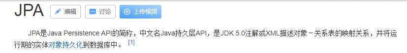

# Spring Data JPA

## 1. Springboot集成 jpa 框架

### 1.1 JPA的概述

> `JPA是一个持久层的ORM框架`，是对jdbc的封装。使用JPA可以实现使用实体对象就能够实现对数据库表的CRUD操作。

`ORM关系映射`：

| 关系型数据库 | java   |
| ------------ | ------ |
| 数据表       | 实体类 |
| 表记录       | 对象   |
| field        | 属性   |

NOTE：java程序员面向对象的角度操作数据，由于我们的对象和对象中的属性已经和关系型数据库当中表和字段一一对应。我们操作了对象就能够操作表中的记录。

