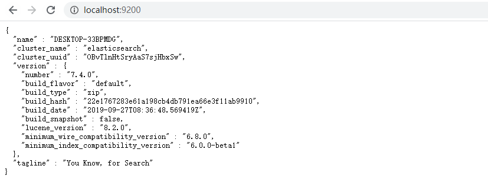
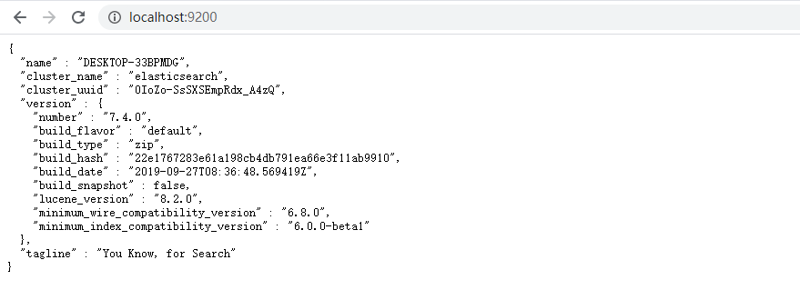

# ElasticSearch

## 一、Restful概念

### 1. 什么是RestFul?

`定义`：如果一个架构符合Rest设计，就称这个架构为Restful架构。Restful是一种软件架构风格，既不是标准也不是规范。

### 2. 什么是Rest?

HTTP协议

`REST`：Resource Representational State Transfer 资源的表现层状态转化

`Representational`：表现层。将网络中资源具体呈现出来的形式称之为表现层

`State Transfer`：状态转化。如果客户端要操作服务器端资源，必须通过某种手段让服务器的资源发生状态转化。

Rest设计原则：

>- 使用REST的URL替换传统URL请求
>
>  传统url：http://localhost:8989/xxx/find?id=21
>
>  RestURL：http://localhost:8989/xxx/find/id
>
>- 使用http四种动词对应服务器端四种操作
>
>  HTTP动词：GET查询获取资源	POST更新操作(添加)	PUT添加操作(更新)	DELETE删除操作

Restful应用场景

```java
@RestController	//这是一个Restful风格控制器
xxxController
//GET查询
@GetMapping("/get")
public String get() {
  ...
}
@PostMapping("/update")
public String post() {
  ...
}
@PutMapping("/put")
public String put() {
  ...
}
```

## 二、ElasticSearch

### 1. 什么是全文检索？


### 2. ElasticSearch安装

前提条件jdk环境

网上提供的安装教程[Windows下安装elasticsearch7.4.0+Kibana+ik分词器](https://blog.csdn.net/qq_38138069/article/details/102516947)

#### 1）安装`elasticsearch`

> - 点击[ElasticSearch](https://www.elastic.co/cn/downloads/past-releases/elasticsearch-6-3-2)下载ZIP包并解压
> - 双击bin目录下elasticsearch.bat文件，访问localhost:9200（默认端口号9200）



**注意**：ElasticSearch安装包应该放在没有空格和汉字的路径下，否则请求时会出现500

#### 2）安装ElasticSearch的操作界面`kibana`

> - 点击[kibana](https://www.elastic.co/cn/downloads/past-releases#kibana)下载与elasticsearch相同版本的kibana并解压；
> - 双击bin目录下kibana.bat文件启动kibana，启动完成后访问localhost:5601（默认端口号5601）

**注意**：kibana默认连接本地的elasticsearch，如需访问其他服务器的es或者es的端口号有被调整过，需要在config/kibana.yml文件中重新设置elasticsearch.hosts

#### 3）安装`IK分词器`

> - 点击[IK分词器](https://github.com/medcl/elasticsearch-analysis-ik/releases)下载对应版本的elasticsearch_analysis_ik；
> - 在elasticsearch安装包plugins文件夹下创建文件analysis-ik文件，将ik分词器zip包解压到该文件夹；
> - 在config文件夹下的IKAnalyzer.cfg.xml配置文件中添加自定义分词此表和停用词词表，在相应的词表文件中添加分词重启es就可以啦~

`安装elasticsearch-head`

- 安装node.js，官网[https://nodejs.org/zh-cn/download/](https://nodejs.org/zh-cn/download/)下载node.js的msi版本进行傻瓜式安装；安装完成进入cmd终端执行node可进入node环境，两次ctrl+c退出；查看版本node -v   npm-v；安装淘宝npm:npm install ``-``g cnpm ``-``-``registry``=``https:``/``/``registry.npm.taobao.org；安装脚手架npm install ``-``g @vue``/``cli；版本2：npm install ``-``g @vue``/``cli；执行vue -V验证安装是否成功
- 安装grunt

```js
npm install -g cnpm --registry=https://registry.npm.taobao.org
cnpm install -g grunt-cli
```

- 安装elasticsearch-head：[https://github.com/mobz/elasticsearch-head](https://github.com/mobz/elasticsearch-head)下载解压；cmd终端进入elasticsearch-head-master目录，执行npm install，完成之后启动npm run start，访问localhost:9100

`es默认不允许跨域连接，若想实现跨域，进入elasticsearch的config目录下修改文件elasticsearch.yml：末尾添加 http.cors.enabled: true
　　　　 http.cors.allow-origin: "*" 然后再重启`


## 1. 什么是全文检索？

**`全文检索`是计算机程序通过扫描文章中的每一个词，对每一个词建立一个索引，指明该词在文章中出现的次数和位置。当用户查询时根据建立的索引查找，类似于通过字典的检索字表查字的过程。**

全文检索以文本作为检索对象，找出含有指定词汇的文本。**`全面`**、**`准确`**、**`快速`**

关于全文检索：

1. **只处理文本，不处理语义。**
2. **搜索时英文不区分大小写。**
3. **结果列表有相关度排序。**


## 2. 什么是Elastic Search

**ElasticSearch**简称**ES**，是**基于Apache Lucene构建的开源搜索引擎，是当前流行的企业级搜索引擎**。Lucene本身就可以被认为迄今为止性能最好的一款开源搜索引擎工具包，但是Lucene的API相对复杂，需要深厚的搜索理论。很难集成到实际的应用中去。**但是ES是采用java语言编写，提供了简单易用的RestFul API，开发者可以使用其简单的RestFul API来开发相关的搜索功能，从而避免Licene的复杂性**。


## 3. ES的实际应用

**ES主要以轻量级JSON作为数据存储格式，同时支持地理位置查询，方便地理位置和文本混合查询。在统计、日志类数据存储和分析、可视化方面是引领者。**

- **国外**

  **Wikipedia**(维基百科)使用ES提供全文搜索并高亮关键字、**StackOverflow**(IT问答网站)结合全文搜索与地理位置查询、**Github**使用Elasticsearch检索1300亿行代码。

- **国内**

  **百度**、**新浪**、**阿里巴巴**、**腾讯**等公司均有对ES的使用。


## 4. ES安装

> 安装与启动（Windows）：
>
> 1. 官网下载指定版本zip包解压到本地目录
> 2. 双击执行bin目录下elasticsearch.bat文件，浏览器访问localhost:9200

启动成功



注意：

- ElasticSearch安装包应该放在没有`空格`和`汉字`的路径下，否则请求时会出现500

- 启动ES终端可能会出现中文乱码的问题，修改config目录下jvm.options配置文件 `-Dfile.encoding=GBK` 即可

## 5. ES中基本概念

### 5.1 接近实时(NRT Near Real Time)

**Elasticsearch是一个接近实时的搜索平台**。这意味着，**从索引一个文档到这个文档能够被搜索到有一个轻微的延迟(通常是1秒内)**

### 5.2 索引(index)

**一个索引就是一个拥有几分相似特征的文档的集合** 。**一个索引由一个名字来标识(必须全部是小写字母)，当我们对索引中的文档进行搜索、更新和删除时都要用到这个名字**。索引类似关系型数据库中的Database概念。

### 5.3 类型(type)

类型是索引的一个逻辑上的分类，通常会**把具有一组共同字段的文档定义为一个类型**。

5.x版本一个索引可以定义一种或多种类型，6.x版本可以使用但不推荐，**7.0版本之后不再支持类型，默认为**` _doc`

### 5.4 映射(mapping)

**Mapping**是ES中一个很重要的内容，**它类似于传统关系型数据中table的schema，用于定义一个索引(index)中类型(type)的数据的结构**。在ES中，我们可以手动创建mapping，也可采用默认创建方式。**在默认配置下，ES可以根据插入的数据自动创建mapping。mapping中主要包括字段名、字段数据类型和字段索引类型。**

### 5.5 文档(document)和字段(field)

**一个文档是一个可被索引的基础信息单元，类似于表中的一条记录。**文档以采用了轻量级的数据交换格式JSON(JavaScript Object Notation)来表示。一个文档中有多个字段

## 6. Kibana安装

> 安装与启动（Windows）：
>
> 1. 官网下载压缩包解压到本地
> 2. 启动kibana：双击bin目录下kibana.bat文件，浏览器访问localhost:5601
>

注意：

- kibana版本需要与elasticsearch一致
- kibana默认连接本地的elasticsearch服务，需要连其他服务器需修改config/kibana.yml文件中elasticsearch.hosts的值

## 7. IK分词器

> NOTE：默认ES中采用标准分词器进行分词，对中文采用单字分词、拥吻采用单词分词。这种方式并不适用于中文，因此需要修改ES对中文友好分词，从而得到更佳的效果

### 7.1 安装IK分词器

1. 点击https://github.com/medcl/elasticsearch-analysis-ik/releases下载对应版本的IK分词器
2. 在elasticsearch安装包的plugins文件下创建文件夹analysis-ik，将IK压缩包解压到该文件夹
3. 重启es即可使用

> NOTE：要求ik版本必须与ES版本一致

### 7.2 测试IK分词器

IK分词器提供了两种mapping类型用来做文档的分词，分别是`ik_max_word`和`ik_smart`

> `ik_max_word 和 ik_smart有什么区别？`
>
> `ik_max_word`：会将文本做最细粒度的拆分，比如会将“中华人民共和国国歌”拆分为“中华人民共和国，中华人民，中华，华人，人民共和国，人民，人，人民，共和国，共和，和，国国，国歌；
>
> `ik_smart`：会做最粗粒度的拆分，比如会将“中华人民共和国国歌”拆分为“中华人民共和国，国歌”。

分词测试

```json
GET /_analyze
{
  "text": "中华人民共和国国歌",
  "analyzer": "ik_smart"
}
```

### 7.3 配置扩展词典与停用词典

> NOTE：IK支持自定义`扩展词典`和`停用词典`，所谓`扩展词典`就是有些词并不是关键词，但是也希望被ES用来作为检索的关键词，可以将这些词加入扩展词典。如：“碰瓷”、“杠精”、“我太难了”等等。`停用词典`就是有些词是关键词，但是出于业务场景不想让这些关键词被检索到，可以将这些词放入停用词典。
>
> 词典文件一行一个词

配置扩展词典和停用词典：修改IK分词器config目录下`IKAnalyzer.cfg.xml`文件

```xml
<?xml version="1.0" encoding="UTF-8"?>
<!DOCTYPE properties SYSTEM "http://java.sun.com/dtd/properties.dtd">
<properties>
	<comment>IK Analyzer 扩展配置</comment>
	<!--用户可以在这里配置自己的扩展字典 -->
	<!--<entry key="ext_dict">/my_word.dic</entry>-->
	 <!--用户可以在这里配置自己的扩展停止词字典-->
	<!--<entry key="ext_stopwords">my_stopwords.dic</entry>-->
	<!--用户可以在这里配置远程扩展字典,文件格式UTF-8 -->
	<entry key="remote_ext_dict">http://127.0.0.1:8087/es/my_word.txt</entry>
	<!--用户可以在这里配置远程扩展停止词字典,文件格式UTF-8-->
	<entry key="remote_ext_stopwords">http://127.0.0.1:8087/es/my_stopwords.txt</entry>
</properties>
```


## 8. Kibana基本操作

### 8.1 索引(Index)的基本操作

#### 8.1.1 索引增删操作

```http
PUT /ems					创建索引
DELETE /ems					删除索引
DELETE /*					删除所有索引（包括kibana自动创建的索引，kibana无法正常运行需要重启）
```

#### 8.1.2 创建带有映射的索引

```json
PUT /employee
{
  "settings": {
    "number_of_shards": 1,
    "number_of_replicas": 0
  },
  "mappings": {
    "properties": {
      "indexId": {
        "type": "long"
      },
      "name": {
        "type": "text",
        "analyzer": "ik_smart"
      },
      "sex": {
        "type": "keyword"
      },
      "age": {
        "type": "integer"
      },
      "birth": {
        "type": "date",
        "format": "yyyy-MM-dd HH:mm:ss||yyyy-MM-dd||epoch_millis"
      },
      "description": {
        "type": "text",
        "analyzer": "ik_smart"
      },
      "hobby": {
        "type": "text",
        "analyzer": "ik_smart"
      },
      "dept": {
        "type": "text",
        "analyzer": "ik_smart"
      },
      "isRegular": {
        "type": "boolean"
      }
    }
  }
}

GET /employee/_mapping		查看映射
```

> mapping type：**keyword、text、integer、long、double、date、boolean、ip**

#### 8.1.3 查看索引信息

```http
GET /_cat/indices?v			查看索引信息
```

查询结果参数详解

> `health`：索引状态，green 索引健壮、yellow索引可用但不健壮（主分片和副本分片在同一台机器）、red索引不可用
>
> `pri`：主分片个数
>
> `rep`：副本分片个数
>
> `docs.count`：存储的文档个数
>
> `docs.deleted`：删除文档个数
>
> `store.size`：文档存储的大小
>
> `pri.store.size`：主分片存储的大小

### 8.2 文档(Document)的基本操作

#### 添加文档

```json
#随机生成id式新增
POST /employee/_doc
{
  "name": "张三",
  "age": 23,
  "sex": "男",
  "content": "江湖人物"
}

#指定id式新增（id如果已经存在，则是删除原来数据重新新增）
PUT /employee/_doc/1
{
  "name": "张三",
  "age": 26
}

#指定id新增（若id已经存在，则是先删除后新增）
POST /employee/_doc/1
{
  "name": "六六"
}
```

#### 查询文档

```http
GET /employee/_doc/1
```

#### 删除文档

```json
DELETE /employee/_doc/1
#返回结果：
{
  "_index" : "employee",
  "_type" : "_doc",
  "_id" : "1",
  "_version" : 5,
  "result" : "deleted",
  "_shards" : {
    "total" : 1,
    "successful" : 1,
    "failed" : 0
  },
  "_seq_no" : 13,
  "_primary_term" : 1
}

```

#### 更新文档

```json
#方式1 原有数据基础上更新
POST /employee/_update/1
{
  "doc": {
    "name": "王武",
    "age": 25,
    "sex": "男",
    "hobby": "打篮球"
  }
}

#方式2 
POST /employee/_update/1
{
  "script": "ctx._source.age += 5"
}
```

#### 批量操作

```json
POST /employee/_bulk
{"index": {}}
{"name": "唐艺昕","age":33,"sex":"女","birth":"1987-10-09","description":"毕业于重庆大学美视电影学院表演系，中国内地女演员。2011年，唐艺昕出演个人首部电视剧《后宫·甄嬛传》，并凭借此剧而在演艺圈崭露头角。2013年，出演个人首部电影《西游·降魔篇》。","isRegular":true,"dept":"数据智能部"}
{"index":{}}
{"name": "张若昀","age":32,"sex":"男","birth":"1988-08-24","description":"2004年，通过参演首部电视剧《海的誓言》而进入演艺圈。2011年，凭借励志革命剧《黑狐》中方天翼一角广受关注，并演唱片尾曲《坚强的人》，夺得“最受观众喜爱的电视剧新人”奖、第二届乐视影视盛典电视剧最佳新人奖。2013年，在战争剧《新雪豹》中出演男主角周卫国","isRegular":true,"dept":"数据智能部"}

#没有任何更新返回的result值为noop
PUT /employee/_bulk
{"index": {}}
{"name": "唐艺昕","age":33,"sex":"女","birth":"1987-10-09","description":"毕业于重庆大学美视电影学院表演系，中国内地女演员。2011年，唐艺昕出演个人首部电视剧《后宫·甄嬛传》，并凭借此剧而在演艺圈崭露头角。2013年，出演个人首部电影《西游·降魔篇》。","isRegular":true,"dept":"数据智能部"}
{"index":{}}
{"name": "张若昀","age":32,"sex":"男","birth":"1988-08-24","description":"2004年，通过参演首部电视剧《海的誓言》而进入演艺圈。2011年，凭借励志革命剧《黑狐》中方天翼一角广受关注，并演唱片尾曲《坚强的人》，夺得“最受观众喜爱的电视剧新人”奖、第二届乐视影视盛典电视剧最佳新人奖。2013年，在战争剧《新雪豹》中出演男主角周卫国","isRegular":true,"dept":"数据智能部"}
{"update": {"_id": "EK1JpHMBI0WREregx42R"}}
{"doc":{"name":"张若昀i"}}
{"delete": {"_id": "EK1JpHMBI0WREregx42R"}}

注意：批量时不会因为一个数据失败而失败，而是会继续执行后续操作，批量在返回时按照执行的状态开始返回
```

## 9. ES高级检索

### 9.1 检索方式_search

ES官方提供两种检索方式：一种是通过URL参数进行搜索，另一种是通过DSL(Domain Specified Language)进行搜索。官方更推荐使用第二种方式，因为第二种方方式是基于传递JSON作为请求体(request body)格式与ES进行交互，这种方式更强大、更简洁。

- 使用语法

  URL查询：GET /索引/_search?参数

  DSL查询：GET/索引/_search {}

### 9.2 测试数据准备

```json
#1. 创建索引
PUT /course
{
  "settings": {
    "number_of_shards": 1,
    "number_of_replicas": 0
  },
  "mappings": {
    "properties": {
      "courseId": {
        "type": "long"
      },
      "title": {
        "type": "text",
        "analyzer": "ik_max_word"
      },
      "description": {
        "type": "text",
        "analyzer": "ik_max_word"
      },
      "price": {
        "type": "double"
      },
      "lecture": {
        "type": "keyword"
      },
      "difficulty": {
        "type": "keyword"
      },
      "learningNum": {
        "type": "integer"
      },
      "updateTime": {
        "type": "date",
        "format": "yyyy-MM-dd HH:mm:ss||yyyy-MM-dd||epoch_millis"
      }
    }
  }
}

#批量添加数据
PUT /course/_bulk
{"index":{}}
{"courseId":9601,"title":"Vue2.5->2.6->3.0开发去哪儿网App从零基础入门到实战项目开发","description":"课程跟随Vue版本迭代升级，结合理论与项目带你掌握Vue开发的基础知识与开发技巧。","price":266.00,"lecture":"Dell","difficulty":"中级","learningNum":5173,"updateTime":"2020-05-21 10:00:00"}
{"index":{}}
{"courseId":9602,"title":"Vue2.0开发企业级移动端音乐Web App","description":"全网稀缺的Vue.js高级应用实战教学","price":399.00,"lecture":"ustbhuangyi","difficulty":"高级","learningNum":5173,"updateTime":"2020-05-12 21:00:00"}
{"index":{}}
{"courseId":9603,"title":"axios在Vue中的使用","description":"本课程包含axios的基本数据请求，实例配置讲解以及在项目中的应用封装。","price":0,"lecture":"小吕","difficulty":"中级","leaningNum":18771,"updateTime":"2020-02-27"}
{"index":{}}
{"courseid":9604,"title": "3小时速成 Vue2.x 核心技术","description": "通过本课程，大家可以了解vue2.x的核心技术，建立前端组件化的思想，包括：常用的vue语法，vue-router，vuex，vue-cli等。我会手把手带大家使用vue-cli工具，快速构建vue项目。认识项目目录的同时，学会如何集成vue2.x到已有项目中，以及调试vue组件。从理论到实践，从小白到熟悉应用，我们配合实际的多案例共同进步。","price":0.00,"lecture":"Brian","difficulty":"中级","learningNum":68092,"updateTime":"2020-05-01"}
{"index":{}}
{"courseId":9605,"title":"适合后端编程人员的elasticsearch快速实战教程","description":"elasticsearch6.8.0已更新结合springboot2.x已上线,赶紧来GET吧!","price":0.00,"lecture":"编程不良人","difficulty":"中级","learningNum":8804,"updateTime":"2020-07-09 06:00:26"}
{"index":{}}
{"courseId":9606,"title":"图解+仿写 新手都能学懂的SpringBoot源码课","description":"Java开发必会、行业风向标级框架，BAT架构师带你一课攻克SpringBoot源码","price":366.00,"lecture":"跳跳虎","difficulty":"中级","learningNum":741,"updateTime":"2019-12-25 08:05:12"}
{"index":{}}
{"courseId":9607,"title":"SpringBoot短视频小程序开发全栈式实战项目","description":"本课程基于微信小程序和目前主流的后端技术SpringBoot/SpringMVC来实现一个完整的短视频小程序App。通过对本套课程的学习，可以使你独立开发一个短视频小程序并部署到腾讯云上，掌握全栈式开发，更是毕业设计利器！","price":348.00,"lecture":"风间影月","difficulty":"中级","learningNum":2172,"updateTime":"2020-05-01"}
{"index":{}}
{"courseId":9608,"title":"Spring Boot2.0不容错过的新特性 WebFlux响应式编程","description":"北京时间 3 月 1 日，SpringBoot2.0 正式发布。作为 Spring 生态中的重要开源项目， SpringBoot2.0 中加入了众多令人激动的新特性，其中最亮眼的，莫过于使用 Spring WebFlux提供响应式 Web 编程。本课程从基础讲解到实践，带你玩转SpringBoot2.0响应式编程。","price":128,"lecture":"晓风轻","difficulty":"中级","learningNum":968,"updateTime":"2020-01-01 11:00:00"}
{"index":{}}
{"courseId":9609,"title":"Springboot 微信小程序 – 微信登录功能实战","description":"通过学习本课程可以掌握如何使用微信api，如何使用httpClient工具跨服务器调用微信url，掌握如何解析string到自己封装的model，掌握自定义会话保存至redis","price":0.00,"lecture":"风间影月","difficulty":"初级","learningNum":41869,"updateTime":"2020-03-15 11:40:53"}
{"index":{}}
{"courseId":9610,"title":"JavaScript版数据结构与算法 轻松解决前端算法","description":"本课程带你用JS语言解决LeetCode上的经典算法题，对每一道题都进行线上测试，每题都有时间/空间复杂度分析。结合前端实际开发情景，带你掌握数据结构与算法。","price":299,"lecture":"lewis","difficulty":"中级","learningNum":400,"updateTime":"2019-11-18 21:00:02"}
{"index":{}}
{"courseId":9611,"title":"适合后端开发人员的bootstrap超详细使用教程,结合springboot案例","description":"bootstrap超详细入门教程,赶紧来GET吧！","price":0,"lecture":"编程不良人","difficulty":"中级","learningNum":8454,"updateTime":"2020-06-16 00:08:53"}
{"index":{}}
{"courseId":9612,"title":"适用于后端编程人员的Vue实战教程,整合SpringBoot项目案例","description":"百知教育Vue男哥经典教程","price":0,"lecture":"编程不良人","difficulty":"初级","learningNum":4200,"updateTime":"2020-03-08 02:36:17"}
{"index":{}}
{"courseId":9613,"title":"Node.js从零开发Web Server博客项目 前端晋升全栈工程师必备","description":"本课程以博客项目为主线，由浅入深讲解 Node.js 基础知识、框架和插件原理、web Server 的特点与必备模块；同时运用 Node.js 原生和常用框架Express、Koa2框架三种方式开发web Server，在项目开发过程中全面掌握Node.js。掌握全栈工程师必备技能，为你带来开发和求职的双重收获！","price":288.00,"lecture":"双越","difficulty":"中级","learningNum":2268,"updateTime":"2020-03-01 00:01:20"}
{"index":{}}
{"courseId":9614,"title":"Nodejs全栈入门","description":"整个项目重点分为2部分，前端通过react+redux实现UI界面和状态管理，后端使用express做web框架，使用mysql作为数据存储，利用 sequelize作为ORM，便于通过nodejs管理和操作mysql。","price":199.00,"lecture":"一缕孤烟","difficulty":"中级","learningNum":15187,"updateTime":"2020-05-06 22:30:09"}
{"index":{}}
{"courseId":9615,"title":"告别996，开启Java高效编程之门","description":"本课程剑指Java高效编程，致力于从“技术”和“工具”两大 维度提高编程效率，帮助广大程序员或者未来的程序员逃离“996的魔咒”，塑造“代码洁癖”的编程风格。","price":288,"lecture":"张小喜","difficulty":"初级","learningNum":1003,"updateTime":"2020-01-05 21:45:12"}
{"index":{}}
{"courseId":9616,"title":"剑指Java自研框架，决胜Spring源码","description":"通过从0搭建一个较为完备的web框架来提升自己的框架设计能力，同时能够管中窥豹，去了解Spring框架的设计思路，再辅以通俗易懂的Spring核心模块源码的讲解，将课程门槛拉低，让大家通过学习本门课程后能够通过自己学习读懂Spring乃至其他框架的源码。","price":399.00,"lecture":"翔仔","difficulty":"中级","learningNum":608,"updateTime":"2020-07-12"}
{"index":{}}
{"courseId":9617,"title":"一站式学习Redis 从入门到高可用分布式实践","description":"课程包含Redis基础，使用经验介绍、Java，Python客户端示范、Redis使用规范，由浅入深讲解并伴有企业中Redis开发的相关项目以及大规模Redis的实战经验，是开发和运维人员系统学习Redis的必备内容","price":348,"lecture":"carlosfu","difficulty":"中级","learningNum":1854,"updateTime":"2019-11-23 09:23:40"}
{"index":{}}
{"courseId":9618,"title":"性能优化之MySQL优化","description":"目前数据库是大多数系统进行数据存储的基础组件，数据库的效率对系统的稳定和效率有着至关重要的影响；为了有更好的用户体验，数据库的优化显得异常重要。那么我们要从那些方面对我们的数据库进行优化呢？让我们在这门课程中共同探讨一起学习吧！","price":189,"lecture":"sqlercn","difficulty":"中级","learningNum":94077,"updateTime":"2019-05-30 00:16:29"}
{"index":{}}
{"courseId":9619,"title":"MySQL开发技巧（二）","description":"一个不懂SQL技巧的程序员不是一个好程序员。","price":69,"lecture":"sqlercn","difficulty":"中级","learningNum":58675,"updateTime":"2019-10-05 15:10:00"}
{"index":{}}
{"courseId":9620,"title":"MySQL开发技巧（三）","description":"一个不懂SQL技巧的程序员不是一个好程序员。","price":69,"lecture":"sqlercn","difficulty":"中级","learningNum":5236,"updateTime":"2019-10-10 14:30:29"}
{"index":{}}
{"courseId":9621,"title": "微信小程序入门与实战常用组件API开发技巧项目实战","description": "本课程中，讲师带你从0开始构建一个功能齐整的小程序，跟进当前潮流技术点，先人一步实现小程序开发组件化。","lecture": "七月"}
```

### 9.3 URL检索

```http
GET /course/_search?q=*&size=10&sort=updateTime:desc&from=5&_source=name,price
```

> _search 搜索的API
>
> ​	q=*		匹配所有文档
>
> ​	sort		以结果中的指定字段进行排序
>
> ​	from		查询起始位置
>
> ​	_source	返回的字段

### 9.4 DSL高级检索（重点）

#### 9.4.1 查询所有

> **match_all关键字**：返回索引中全部文档

``` http
GET /course/_search
{
  "query": {
    "match_all": {}
  }
}
```


#### 9.4.2 查询结果中返回指定条数（size）

> **size关键字**：指定查询结果中返回指定条数。默认返回10条数据

```http
GET /course/_search
{
  "query": {
    "match_all": {}
  },
  "size":5
}
```

#### 9.4.3 分页查询（from）

> **from关键字**：用来指定起始返回位置，和**size关键字连用可实现分页效果**

```http
GET /course/_search
{
  "query": {
    "match_all": {}
  },
  "from":5,
  "size":5
}
```

#### 9.4.4 查询结果中返回指定字段（_source）

> **_source关键字**：是一个数组，在数组中用来指定展示哪些字段

```http
GET /course/_search
{
  "query": {
    "match_all": {}
  },
  "_source": ["title", "price","difficulty"]
}
```

#### 9.4.5 关键字查询（term）

> **term关键字**：用来使用关键字查询

```http
GET /course/_search
{
  "query": {
    "term": {
      "lecture": {
        "value": "编程不良人"
      }
    }
  }
}
```

**NOTE：通过使用tern查询可知，在ES中Mapping中keyword, date, integer, long, double, boolean, ip这些类型部分词，只有text类型分词。**

#### 9.4.6 范围查询（range）

> **range关键字**：用来指定查询指定范围内的文档

```http
GET /course/_search
{
  "query": {
    "range": {
      "price": {
        "gt": 0,
        "lte": 100
      }
    }
  }
}
```

#### 9.4.7 前缀查询（prefix）

> **prefix关键字**：用来检索含有指定前缀的关键字的相关文档

```http
GET /course/_search
{
  "query": {
    "prefix": {
      "title": {
        "value": "mysql"
      }
    }
  }
}
```

#### 9.4.8 通配符查询（wildcard）

> **wildcard关键字**：通配符查询 ?用来匹配一个任意字符  *用来匹配多个任意字符

```http
GET /course/_search
{
  "query": {
    "wildcard": {
      "difficulty": {
        "value": "*级"
      }
    }
  }
}
```

#### 9.4.9 多id查询（ids）

> **ids关键字**：值为数组类型，用来根据一组id获取多个对应的文档

```http
GET /course/_search
{
  "query": {
    "ids": {
      "values": ["x2gQrnMBf4NRW_ZXWuBH", "yGgQrnMBf4NRW_ZXWuBH"]
    }
  }
}
```

#### 9.4.10 模糊查询（fuzzy）

> **fuzzy关键字**：用来模糊查询含有指定关键字的文档
>
> **NOTE**：最大模糊错误必须在0~2之间
>
> ​				搜索关键词长度在1~2  不允许存在模糊 0
>
> ​				搜索关键词长度在3~5  允许一次模糊     0 1
>
> ​				搜索关键词长度大于5	允许最大模糊2

```http
GET /course/_search
{
  "query": {
    "fuzzy": {
      "title": "springbeet"
    }
  }
}
```

#### 9.4.11 布尔查询（bool）

> **bool关键字**：用来组合多个条件实现复杂查询
>
> ​	**must：相当于and同时成立**
>
> ​	**should：相当于or成立一个就行**
>
> ​	**must_not：不能满足任何一个**

```http
GET /course/_search
{
  "query": {
    "bool": {
      "must": [
        {
          "term": {
            "title": {
              "value": "springboot"
            }
          }
        },
        {
          "term": {
            "difficulty": {
              "value": "中级"
            }
          }
        }
      ],
      "must_not": [
        {
          "range": {
            "updateTime": {
              "lte": "2019-12-31 23:59:59"
            }
          }
        }
      ]
    }
  }
}
```

#### 9.4.12 高亮查询（highlight）

> **highlight关键字**：可以让符合条件的文档中的关键词高亮
>
> **自定义高亮html标签**：可以在highlight中使用`pre_tags`和`post_tags`

```http
GET /course/_search
{
  "query": {
    "term": {
      "description": {
        "value": "springboot"
      }
    }
  },
  "highlight": {
    "pre_tags": ["<span style='color:red'>"], 
    "post_tags": ["</span>"], 
    "fields": {
      "description": {}
    }
  }
}
```

#### 9.4.13 多字段查询（multi_match）

> **multi_match关键字**：多个字段中查询同一个关键词

```http
GET /course/_search
{
  "query": {
    "multi_match": {
      "query": "项目",
      "fields": ["title", "description"]
    }
  }
}
```

#### 9.4.14 多字段分词查询（query_string）

> **query_string关键字**：先将查询内容按照分词器分词再做相应的匹配

```http
GET /course/_search
{
  "query": {
    "query_string": {
      "default_field": "description",
      "analyzer": "ik_smart", 
      "query": "实战教学"
    }
  }
}
```

## 10. 过滤查询 Filter Query

### 10.1 过滤查询

> 其实准确来说，ES中的查询操作分为2种: `查询(query)`和`过滤(filter)`。`查询即是之前提到的query查询，它 (查询)默认会计算每个返回文档的得分，然后根据得分排序`。`而过滤(filter)只会筛选出符合的文档，并不计算 得分，且它可以缓存文档 。所以，单从性能考虑，过滤比查询更快`。 
>
> 换句话说，过滤适合在大范围筛选数据，而查询则适合精确匹配数据。一般应用时， 应先使用过滤操作过滤数据， 然后使用查询匹配数据。

#### 10.2 过滤语法

> **NOTE**：
>
> 1. 在执行filter和query时，先执行filter后执行query
>
> 2. Elasticsearch会自动缓存经常使用的过滤器，以加快性能

### 10.3 常见的过滤器类型

#### 10.3.1 term、terms Filter

```http
# 使用term过滤
GET /course/_search
{
  "query": {
    "bool": {
      "must": [
        {
          "term": {
            "description": {
              "value": "程序员"
            }
          }
        }
      ],
      "filter": {
        "term": {
          "difficulty": "中级"
        }
      }
    }
  }
}

# 使用terms过滤
GET /course/_search
{
  "query": {
    "bool": {
      "must": [
        {
          "term": {
            "title": {
              "value": "springboot"
            }
          }
        }
      ],
      "filter": {
        "terms": {
          "difficulty": ["中级", "初级"]
        }
      }
    }
  }
}
```

#### 10.3.2 range fFilter

```http
GET /course/_search
{
  "query": {
    "bool": {
      "must": [
        {
          "match_all": {}
        }
      ],
      "filter": {
        "range": {
          "price": {
            "gte": 10,
            "lte": 100
          }
        }
      }
    }
  }
}
```

#### 10.3.3 exists filter

> **过滤存在指定字段，获取字段不为空的索引记录**

```http
GET /course/_search
{
  "query": {
    "bool": {
      "must": [
        {
          "match_all": {}
        }
      ],
      "filter": {
        "exists": {
          "field": "difficulty"
        }
      }
    }
  }
}
```

#### 10.3.4 ids filter

> **过滤含有指定字段的索引记录**

```http
GET /course/_search
{
  "query": {
    "bool": {
      "must": [
        {
          "match_all": {}
        }
      ],
      "filter": {
        "ids": {
          "values": [
            "yGgQrnMBf4NRW_ZXWuBH","yWgQrnMBf4NRW_ZXWuBH"
          ]
        }
      }
    }
  }
}
```

## 11. 统计

### 11.1 avg（平均值）

> 计算从聚合文档中提取的数值的平均值

```http
GET /course/_search?size=0
{
  "aggs": {
    "avg_price": {
      "avg": {
        "field": "price"
      }
    }
  }
}
```

### 11.2 min/max（最大值/最小值）

> 计算从聚合文档中提取的数值的最大值/最小值

```http
#最大值
GET /course/_search?size=0
{
  "aggs": {
    "max_price": {
      "max": {
        "field": "price"
      }
    }
  }
}

#最小值
GET /course/_search?size=0
{
  "aggs": {
    "min_price": {
      "min": {
        "field": "price"
      }
    }
  }
}
```

### 11.3 sum（总和）

> 计算从聚合文档中提取的数值的总和。

```http
GET /course/_search
{
  "query": {
    "bool": {
      "filter": {
        "term": {
          "lecture": "编程不良人"
        }
      }
    }
  },
  "aggs": {
    "sum_price": {
      "sum": {
        "field": "price"
      }
    }
  }
}
```

### 11.4 cardinary（唯一值）

> cardinality 求唯一值，即不重复的字段有多少（相当于mysql中的distinct）

```http
GET /course/_search?size=0
{
  "aggs": {
    "lecture_count": {
      "cardinality": {
        "field": "lecture"
      }
    }
  }
}
```

### 11.5 terms聚合

> terms聚合查询类似mysql中的group by

```http
GET /course/_search?size=0
{
  "aggs": {
    "count_by_lecture": {
      "terms": {
        "field": "lecture",
        "size": 3
      }
    }
  }
}
```

## 12. SpringBoot Data操作ES

### 12.1 引入依赖

```xml
<dependency>
    <groupId>org.springframework.boot</groupId>
    <artifactId>spring-boot-starter-data-elasticsearch</artifactId>
</dependency>
```

### 12.2 编写yml配置

- spring-data（2~3.x版本配置） ElasticTemplate客户端

```yml
spring:
	data:
		elasticsearch:
			cluster-nodes: 172.16.251.142:9300
```

- spring-data（新版本推荐配置）RestHighLevelClient rest客户端 ElasticSearchRepository接口

```java
@Configuration
public class RestClientConfig extends AbstractElasticsearchConfiguration {

    @Override
    @Bean//将client交给工厂管理
    public RestHighLevelClient elasticsearchClient() {
        //定义客户端配置对象 RestClient
        final ClientConfiguration clientConfiguration = ClientConfiguration.builder()
                .connectedTo("localhost:9200")
                .build();
        //通过RestClients对象创建
        return RestClients.create(clientConfiguration).rest();
    }
}
```

### 12.3 使用REST Client操作ES

#### 12.3.1 新增一条文档

```java
@Test
public void testAddOne() throws IOException {
    IndexRequest indexRequest = new IndexRequest("course");
    indexRequest.source("{\"courseId\":9623,\"title\":\"python进阶\",\"description\":\"Python基础分《Python入门》和《Python进阶》两门课程，《Python进阶》是第二门课程，学习该课程前，请先学习《Python入门》,效果会更好。《Python进阶》课程详细介绍Python强大的函数式编程和面向对象编程，掌握Python高级程序设计的方法。\",\"price\":39.9,\"lecture\":\"廖雪峰\",\"difficulty\":\"中级\",\"learningNum\":259542,\"updateTime\":\"2020-01-20 10:20:00\"}", XContentType.JSON);
    IndexResponse indexResponse = restHighLevelClient.index(indexRequest, RequestOptions.DEFAULT);
    System.out.println(indexResponse.status());
}
```

#### 12.3.2 更新一条文档

```java
@Test
public void testUpdate() throws IOException {
    UpdateRequest course = new UpdateRequest("course", "3mj4rnMBf4NRW_ZXYuBB");
    course.doc("{\"price\": 30}", XContentType.JSON);
    UpdateResponse updateResponse = restHighLevelClient.update(course, RequestOptions.DEFAULT);
    System.out.println(updateResponse.status());;
}
```

#### 12.3.3 删除一条文档

```java
@Test
public void testDelete() throws IOException {
    DeleteRequest deleteRequest = new DeleteRequest("course", "3mj4rnMBf4NRW_ZXYuBB");
    DeleteResponse deleteResposne = restHighLevelClient.delete(deleteRequest, RequestOptions.DEFAULT);
    System.out.println(deleteResposne.status());
}
```

#### 12.3.4 批量操作文档

```java
@Test
public void testBulk() throws IOException {

    BulkRequest bulkRequest = new BulkRequest();
    //新增
    IndexRequest indexRequest = new IndexRequest("course");
    indexRequest.source("{\"courseId\":9622,\"title\":\"初识python\",\"description\":\"Python开发的入门教程\",\"price\":29.9,\"lecture\":\"廖雪峰\",\"difficulty\":\"初级\",\"learningNum\":768802,\"updateTime\":\"2019-10-03\"}", XContentType.JSON);
    bulkRequest.add(indexRequest);
    //更新
    UpdateRequest updateRequest = new UpdateRequest("course", "xmgQrnMBf4NRW_ZXWuBH");
    updateRequest.doc("{\"price\": 300.00}", XContentType.JSON);
    bulkRequest.add(updateRequest);
    //删除
    DeleteRequest deleteRequest = new DeleteRequest("course", "32gmr3MBf4NRW_ZXYODq");
    bulkRequest.add(deleteRequest);

    BulkResponse bulkResponse = restHighLevelClient.bulk(bulkRequest, RequestOptions.DEFAULT);
    BulkItemResponse[] bulkItemResponses = bulkResponse.getItems();
    for (BulkItemResponse bulkItemResponse:bulkItemResponses) {
        System.out.println(bulkItemResponse.getId() + "..." + bulkItemResponse.status());
    }
}
```

#### 12.3.5 查询文档

```java
@Test
public void testSearch() {
    SearchRequest searchRequest = new SearchRequest("course");
    SearchSourceBuilder searchSourceBuilder = new SearchSourceBuilder();
    //关键字精确匹配
    TermQueryBuilder termQueryBuilder = new TermQueryBuilder("title",  "springboot");
    //范围查询
    RangeQueryBuilder rangeQueryBuilder = new RangeQueryBuilder("price");
    rangeQueryBuilder.gte(0);
    rangeQueryBuilder.lte(100);
    //前缀查询
    PrefixQueryBuilder prefixQueryBuilder = new PrefixQueryBuilder("title", "mysql");
    //通配符查询
    WildcardQueryBuilder wildcardQueryBuilder = new WildcardQueryBuilder("lecture", "编程*");
    //ids查询
    IdsQueryBuilder idsQueryBuilder = QueryBuilders.idsQuery().addIds("4Ggwr3MBf4NRW_ZXJ-BX","4WhGr3MBf4NRW_ZXBOBT");
    //模糊查询
    FuzzyQueryBuilder fuzzyQueryBuilder = new FuzzyQueryBuilder("title", "springbeet");
    //多字段查询
    MultiMatchQueryBuilder multiMatchQueryBuilder = new MultiMatchQueryBuilder("项目", "title", "description");
    //多字段分词查询
    QueryStringQueryBuilder queryStringQueryBuilder = new QueryStringQueryBuilder("实战教学");
    queryStringQueryBuilder.analyzer("ik_smart");
    queryStringQueryBuilder.field("description");
    //bool查询
    BoolQueryBuilder boolQueryBuilder = new BoolQueryBuilder();
    boolQueryBuilder.must(QueryBuilders.termQuery("title", "springboot"));
    boolQueryBuilder.must(QueryBuilders.termQuery("lecture", "编程不良人"));
    searchSourceBuilder.query(boolQueryBuilder);

    //高亮
    HighlightBuilder highlightBuilder = new HighlightBuilder().field("title").requireFieldMatch(true).preTags("<span style='color:red'>").postTags("</span>");
    searchSourceBuilder.highlighter(highlightBuilder);
    searchSourceBuilder.from(0);
    searchSourceBuilder.size(5);
    searchSourceBuilder.sort("updateTime", SortOrder.DESC);

    searchRequest.source(searchSourceBuilder);
    try {
        SearchResponse searchResponse = restHighLevelClient.search(searchRequest, RequestOptions.DEFAULT);
        SearchHit[] hits = searchResponse.getHits().getHits();
        for (SearchHit searchHit:hits) {
            Map<String, HighlightField> highlightFields = searchHit.getHighlightFields();
            if (highlightFields.containsKey("title")){
                System.out.println("title" + "..." + highlightFields.get("title").fragments()[0].toString());;
            }
            System.out.println(searchHit.getSourceAsMap());
        }
    } catch (IOException e) {
        e.printStackTrace();
    }
}
```

### 12.4 面向对象操作


> ElasticSearchRepository接口面向对象 提供一系列CRUD的方法

#### 12.4.1 编写entity

```java
@Data
@AllArgsConstructor
@NoArgsConstructor
/**
 * document用在类上
 * 作用：将Ems对象映射成ES中一条json格式文档
 * indexName用来指定这个对象的转为json文档存入哪个索引中 要求：ES服务器中之前不存在此索引名
 */
@Document(indexName = "student")
public class Student {
    /**
     * 用来将对象中的id属性与文档中的_id相对应
     */
    @Id
    private String id;
    /**
     * @Field用在属性上 代表mapping中一个属性 一个字段 type:属性 用来指定字段类型  analyzer:指定分词器
     */
    @Field(type = FieldType.Text, analyzer = "ik_smart")
    private String name;
    @Field(type = FieldType.Integer)
    private Integer age;
    @Field(type = FieldType.Date, format = DateFormat.date_time)
    @JsonFormat(pattern = "yyyy-MM-dd HH:mm:ss||yyyy-MM-dd||epoch_millis")
    private Date birth;
    @Field(type = FieldType.Text, analyzer = "ik_smart")
    private String content;
    @Field(type = FieldType.Text, analyzer = "ik_smart")
    private String address;
}
```

#### 12.4.2 编写StudentRepository

```java
//Student为当前操作的对象，String为主键的类型
public interface EmpRepository extends ElasticsearchRepository<Student, String> {
}
```

#### 12.4.3 新增或更新一条文档

```java
@Test
public void testSave() {
    Student student = new Student();
    //        student.setId(UUID.randomUUID().toString());
    student.setName("张三");
    student.setAge(23);
    student.setBirth(new Date());
    student.setContent("江湖人称张三");
    student.setAddress("上海");
    studentRepository.save(student);
}

#批量新增
@Test
public void testSaveAll() {
    List<Student> studentList = new ArrayList<>();
    studentList.add(new Student(UUID.randomUUID().toString(),"梁爽", 21, new Date(), "向着前路，无需退缩，冷美人，毒舌但是内心很柔软，是一个每天晚上10点半睡觉，早起自律的冰美人。", "北京"));
    studentList.add(new Student(UUID.randomUUID().toString(),"罗艳", 20, new Date(), "内心明朗，未来昂扬的二次元少女，喜欢玩游戏，沉浸在游戏里面。", "深圳"));
    studentList.add(new Student(UUID.randomUUID().toString(),"段家宝", 21, new Date(), "追星少女，心里有爱，脚下无碍，来自商人家庭，性格单纯。", "北京"));
    studentRepository.saveAll(studentList);
}
```

#### 12.4.4 查询

```java
@Test
public void testFindOne() {
    Optional<Student> optional = studentRepository.findById("41523f7f-bd3a-4fa0-9b34-c0c480f3b1a0");
    Student student = optional.get();
    System.out.println(student);
}

@Test
public void testFindAll() {
    Iterable<Student> students = studentRepository.findAll(Sort.by(Sort.Order.desc("birth")));
    students.forEach(student -> System.out.println(student));
}

@Test
public void testFindPage() {
    Page<Student> studentList = studentRepository.findAll(PageRequest.of(0, 10, Sort.by(Sort.Order.desc("age"))));
    studentList.forEach(student -> System.out.println(student));
}
```

#### 12.4.5 删除

```java
@Test
public void testDelete() {
    studentRepository.deleteById("fc04ed3b-5b08-43bb-bbc0-b51dcf9f8315");
}

@Test
public void testDeleteAll() {
    studentRepository.deleteAll();
}
```

#### 12.4.6 高亮查询

```java
@Test
public void testSearch() {
    SearchRequest searchRequest = new SearchRequest("student");
    SearchSourceBuilder sourceBuilder = new SearchSourceBuilder();
    BoolQueryBuilder boolQueryBuilder = new BoolQueryBuilder();
    boolQueryBuilder.must(QueryBuilders.termQuery("address", "北京"));
    sourceBuilder.query(boolQueryBuilder)
        .from(0)
        .size(5)
        .sort("birth", SortOrder.ASC)
        .highlighter(new HighlightBuilder().field("*").preTags("<em>").postTags("</em>"));
    searchRequest.source(sourceBuilder);
    try {
        SearchResponse searchResponse = restHighLevelClient.search(searchRequest, RequestOptions.DEFAULT);
        SearchHit[] hits = searchResponse.getHits().getHits();
        List<Student> studentList = new ArrayList<>();
        for (SearchHit searchHit:hits) {
            Map<String, Object> data = searchHit.getSourceAsMap();
            Student student = new Student();
            student.setId(searchHit.getId());
            student.setName(data.get("name").toString());
            student.setAge(Integer.parseInt(data.get("age").toString()));
            student.setBirth(new SimpleDateFormat("yyyy-MM-dd").parse(data.get("birth").toString()));
            student.setContent(data.get("content").toString());
            student.setAddress(data.get("address").toString());
            Map<String, HighlightField> highlightFields = searchHit.getHighlightFields();
            if (highlightFields.containsKey("name")) {
                student.setName(highlightFields.get("name").fragments()[0].toString());
            }
            if (highlightFields.containsKey("content")) {
                student.setContent(highlightFields.get("content").fragments()[0].toString());
            }
            if (highlightFields.containsKey("address")) {
                student.setAddress(highlightFields.get("address").fragments()[0].toString());
            }
            studentList.add(student);
        }
        studentList.forEach(student -> System.out.println(student));
    } catch (IOException | ParseException e) {
        e.printStackTrace();
    }
}
```

#### 12.5 自定义基本查询

| Keyword               | Sample                                            | Elasticsearch Query String                                   |
| --------------------- | ------------------------------------------------- | ------------------------------------------------------------ |
| `And`                 | `findByNameAndPrice`                              | `{"bool" : {"must" : [ {"field" : {"name" : "?"}}, {"field" : {"price" : "?"}} ]}}` |
| `Or`                  | `findByNameOrPrice`                               | `{"bool" : {"should" : [ {"field" : {"name" : "?"}}, {"field" : {"price" : "?"}} ]}}` |
| `Is`                  | `findByName`                                      | `{"bool" : {"must" : {"field" : {"name" : "?"}}}}`           |
| `Not`                 | `findByNameNot`                                   | `{"bool" : {"must_not" : {"field" : {"name" : "?"}}}}`       |
| `Between`             | `findByPriceBetween`                              | `{"bool" : {"must" : {"range" : {"price" : {"from" : ?,"to" : ?,"include_lower" : true,"include_upper" : true}}}}}` |
| `LessThanEqual`       | `findByPriceLessThan`                             | `{"bool" : {"must" : {"range" : {"price" : {"from" : null,"to" : ?,"include_lower" : true,"include_upper" : true}}}}}` |
| `GreaterThanEqual`    | `findByPriceGreaterThan`                          | `{"bool" : {"must" : {"range" : {"price" : {"from" : ?,"to" : null,"include_lower" : true,"include_upper" : true}}}}}` |
| `Before`              | `findByPriceBefore`                               | `{"bool" : {"must" : {"range" : {"price" : {"from" : null,"to" : ?,"include_lower" : true,"include_upper" : true}}}}}` |
| `After`               | `findByPriceAfter`                                | `{"bool" : {"must" : {"range" : {"price" : {"from" : ?,"to" : null,"include_lower" : true,"include_upper" : true}}}}}` |
| `Like`                | `findByNameLike`                                  | `{"bool" : {"must" : {"field" : {"name" : {"query" : "?*","analyze_wildcard" : true}}}}}` |
| `StartingWith`        | `findByNameStartingWith`                          | `{"bool" : {"must" : {"field" : {"name" : {"query" : "?*","analyze_wildcard" : true}}}}}` |
| `EndingWith`          | `findByNameEndingWith`                            | `{"bool" : {"must" : {"field" : {"name" : {"query" : "*?","analyze_wildcard" : true}}}}}` |
| `Contains/Containing` | `findByNameContaining`                            | `{"bool" : {"must" : {"field" : {"name" : {"query" : "**?**","analyze_wildcard" : true}}}}}` |
| `In`                  | `findByNameIn`<br>`(Collection<String>names)`     | `{"bool" : {"must" : {"bool" : {"should" : [ {"field" : {"name" : "?"}}, {"field" : {"name" : "?"}} ]}}}}` |
| `NotIn`               | `findByNameNotIn`<br/>`(Collection<String>names)` | `{"bool" : {"must_not" : {"bool" : {"should" : {"field" : {"name" : "?"}}}}}}` |
| `Near`                | `findByStoreNear`                                 | `Not Supported Yet !`                                        |
| `True`                | `findByAvailableTrue`                             | `{"bool" : {"must" : {"field" : {"available" : true}}}}`     |
| `False`               | `findByAvailableFalse`                            | `{"bool" : {"must" : {"field" : {"available" : false}}}}`    |
| `OrderBy`             | `findByAvailable`<br>`TrueOrderByNameDesc`        | `{"sort" : [{ "name" : {"order" : "desc"} }],"bool" : {"must" : {"field" : {"available" : true}}}}` |

## 13. ES中集群相关概念

### 15.1 相关概念

#### 集群(cluster) 

1.单节点压力问题  并发压力   物理资源上限压力

2.数据冗余备份能力

> 一个集群就是由一个或多个节点组织在一起，它们共同持有你整个的数据，并一起提供索引和搜索功能。一个集群 由一个唯一的名字标识，这个名字默认就是`elasticsearch`。这个名字是重要的，因为一个节点只能通过指定某个集群的名字，来加入这个集群。在产品环境中显式地设定这个名字是一个好习惯，但是使用默认值来进行测试/开发也是不错的。 

#### 节点(node) 

> 一个节点是你集群中的一个服务器，作为集群的一部分，它存储你的数据，参与集群的索引和搜索功能。和集群类似，一个节点也是由一个名字来标识的，默认情况下，这个名字是一个随机的漫威漫画角色的名字，这个名字会在启动的时候赋予节点。这个名字对于管理工作来说挺重要的，因为在这个管理过程中，你会去确定网络中的哪些服务器对应于Elasticsearch集群中的哪些节点。 

> 一个节点可以通过配置集群名称的方式来加入一个指定的集群。默认情况下，每个节点都会被安排加入到一个叫 做“elasticsearch”的集群中，这意味着，如果你在你的网络中启动了若干个节点，并假定它们能够相互发现彼此，它们将会自动地形成并加入到一个叫做“elasticsearch”的集群中。 

> 在一个集群里，只要你想，可以拥有任意多个节点。而且，如果当前你的网络中没有运行任何Elasticsearch节点， 这时启动一个节点，会默认创建并加入一个叫做“elasticsearch”的集群。 

#### 分片和复制(shards & replicas) 

> 一个索引可以存储超出单个结点硬件限制的大量数据。比如，一个具有10亿文档的索引占据1TB的磁盘空间，而任一节点都没有这样大的磁盘空间;或者单个节点处理搜索请求，响应太慢。为了解决这个问题，Elasticsearch提供了将索引划分成多份的能力，这些份就叫做分片。当你创建一个索引的时候，你可以指定你想要的分片的数量。每个分片本身也是一个功能完善并且独立的“索引”，这个“索引”可以被放置 到集群中的任何节点上。 分片之所以重要，主要有两方面的原因: 

> 允许你水平分割/扩展你的内容容量允许你在分片(潜在地，位于多个节点上)之上进行分布式的、并行的操作，进而提高性能/吞吐量 至于一个分片怎样分布，它的文档怎样聚合回搜索请求，是完全由Elasticsearch管理的，对于作为用户的你来说，这些都是透明的。 

> 在一个网络/云的环境里，失败随时都可能发生，在某个分片/节点不知怎么的就处于离线状态，或者由于任何原因 消失了。这种情况下，有一个故障转移机制是非常有用并且是强烈推荐的。为此目的，Elasticsearch允许你创建分 片的一份或多份拷贝，这些拷贝叫做复制分片，或者直接叫复制。复制之所以重要，主要有两方面的原因: 

>  在分片/节点失败的情况下，提供了高可用性。因为这个原因，注意到复制分片从不与原/主要 (original/primary)分片置于同一节点上是非常重要的。 扩展你的搜索量/吞吐量，因为搜索可以在所有的复制上并行运行 

> 总之，每个索引可以被分成多个分片。一个索引也可以被复制0次(意思是没有复制)或多次。一旦复制了，每个 索引就有了主分片(作为复制源的原来的分片)和复制分片(主分片的拷贝)之别。分片和复制的数量可以在索引创建的时候指定。在索引创建之后，你可以在任何时候动态地改变复制数量，但是不能改变分片的数量。 

> 默认情况下，`Elasticsearch中的每个索引被分片5个主分片和1个复制`，这意味着，如果你的集群中至少有两个节点，你的索引将会有5个主分片和另外5个复制分片(1个完全拷贝)，这样的话每个索引总共就有10个分片。一个 索引的多个分片可以存放在集群中的一台主机上，也可以存放在多台主机上，这取决于你的集群机器数量。主分片和复制分片的具体位置是由ES内在的策略所决定的。 