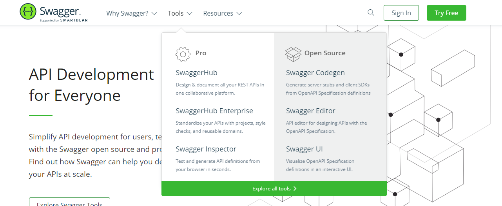
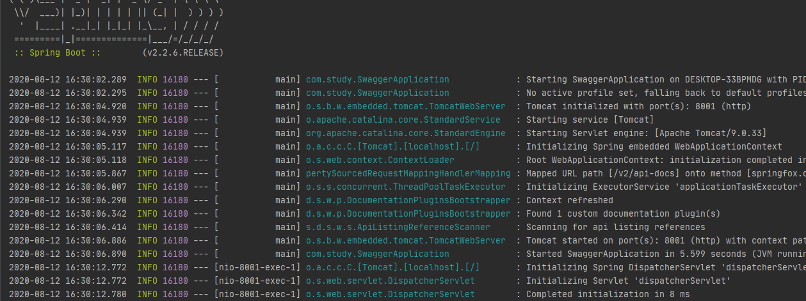
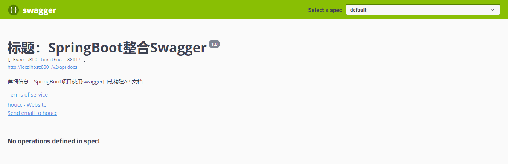
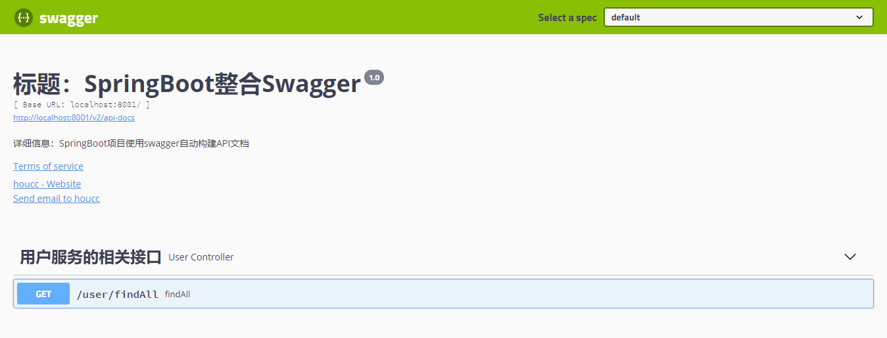

# Swagger

## 引言

​		相信无论是前端还是后端开发，都或多或少的被接口文档折磨过。`前端经常抱怨后端给的接口文档与实际情况不一致。后端又觉得编写及维护接口文档会耗费不少精力，经常来不及更新。无论是前端调用后端，还是后端调用后端，都期望有一个好的接口文档。`但是这个接口文档对于程序员来说，就跟注释一样，经常会抱怨别人写的代码没有注释，然而自己写起代码来，最讨厌的也是写注释。所以仅仅只通过强制来规范大家是不够的，随着时间推移，代码迭代，接口文档往往很容易就跟不上代码了。

## 1. 什么是Swagger

​		发现了痛点就要去找解决方案。解决方案找的人多了，就成了标准的规范，这就是Swagger的由来。通过这套规范，你只需要按照要求去定义接口以及接口相关的信息。再通过Swagger衍生出来的一系列项目和工具，就可以生成各种格式的接口文档，生成多种语言的客户端和服务端的代码，以及在线接口调试页面等等。这样，如果按照新的开发模式，在开发新的版本或者迭代版本的时候，只需要更新Swagger描述文件，就可以自动生成接口文档和客户端服务端代码，做到调用端代码、服务端代码以及接口文档的一致性。

​		但即便如此，对于许多开发来说，编写这个yml或json格式的描述文件，本身也是有一定负担的工作，特别是在后面继续迭代开发的时候，往往会忽略更新描述文件，直接更改代码。久而久之，这个描述文件和实际项目渐行渐远……`所以作为Java届服务端的一大框架Spring，迅速将Swagger规范纳入自身的标准，建立了spring-swagger项目，后面改成了现在的springfox。通过在项目中引入springfox，可以扫描相关的代码，生成该描述文件，进而生成与代码一致的接口文档和客户端代码。`这种通过代码生成接口文档的形式，在后面需求持续迭代的项目中，显得尤为重要和高效。


- `总结`：Swagger就是一个用来定义接口标准、接口规范，同时能根据你的代码自动生成接口说明文档的一个工具。

## 2. 官方提供的工具



​		`Swagger Codegen:` 通过Codegen可以将描述文件生成html格式和cwiki形式的接口文档，同时也能生成多种语言的服务端和客户端的代码。支持通过jar包，docker，node等方式在本地化执行生成。也可以在后面的Swagger  Editor中在线生成。

​		`Swagger UI:` 提供了一个可视化的UI页面展示描述文件。接口的调用方、测试、项目经理等都可以在该页面对相关接口进行查阅和做一些简单的接口请求。该项目支持在线导入描述文件和本地部署UI项目。

​		`Swagger Editor:` 类似于markdown编辑器的编辑Swagger描述文件的编辑器，该编辑支持实时预览描述文件的更新效果。也提供了在线编辑器和本地部署编辑器两种方式。

​		`Swagger Inspector:` 感觉和postman差不多，是一个可以对接口测试的在线版的postman。比在Swagger UI里面做接口请求，会返回更多信息，也会保存你请求的实际请求参数等数据。

​		`Swagger Hub:` 集成了上面所有项目的各个功能，你可以以项目和版本为单位，将你的描述文件上传到Swagger Hub中。在Swagger Hub中可以完成上面项目的所有工作，需要注册账号，分免费版和收费版。

​		`Springfox Swagger:` Spring基于swagger规范，可以将基于SpringMVC和Spring Boot项目的项目代码，自动生成JSON格式的描述文件。本身不是Swagger官网提供的。

## 3. 构建Swagger与SpringBoot环境

### 3.1 引入依赖

```xml
<dependency>
    <groupId>io.springfox</groupId>
    <artifactId>springfox-swagger2</artifactId>
    <version>2.9.2</version>
</dependency>
<dependency>
    <groupId>io.springfox</groupId>
    <artifactId>springfox-swagger-ui</artifactId>
    <version>2.9.2</version>
</dependency>
```

### 3.2 编写Swagger配置类

```java
@Configuration
@EnableSwagger2
public class SwaggerConfig {
    @Bean
    public Docket swaggerCoreConfig() {
        /**
         * 构造函数传入初始化规范，swagger2规范
         * apiInfo(): api文档信息，如标题、描述等
         * select(): 过滤
         * apis: 过滤条件
         */
        return new Docket(DocumentationType.SWAGGER_2)
                .apiInfo(getApiInfo())
                .select()
                .apis(RequestHandlerSelectors.withClassAnnotation(RestController.class))
                .paths(PathSelectors.any())
                .build();
    }

    private ApiInfo getApiInfo() {
        return new ApiInfoBuilder()
                .title("标题：SpringBoot整合Swagger")
                .description("详细信息：SpringBoot项目使用swagger自动构建API文档")
                .termsOfServiceUrl("http://localhost:8001/")
                .version("1.0")
                .contact(new Contact("houcc", "www.houchangchang.com", "1939803734@qq.com"))
                .build();
    }
}
```

### 3.3 启动Springboot应用



### 3.4 访问Swagger的UI界面

- 访问Swagger提供的ui界面：`http://localhost:8080/swagger-ui.html`



## 4. 使用Swagger构建

### 4.1 开发Controller接口

```java
@RestController
@RequestMapping("user")
@Api(tags="用户服务的相关接口")
public class UserController {
    @GetMapping("findAll")
    public Map<String, Object> findAll() {
        Map<String, Object> resultMap = new HashMap<>();
        resultMap.put("code", 200);
        resultMap.put("msg", "请求成功");
        List<User> userList = new ArrayList<>();
        userList.add(new User("张叁", 23));
        userList.add(new User("李肆", 24));
        userList.add(new User("王武", 25));
        resultMap.put("data", userList);
        return resultMap;
    }
}
```

### 4.2 重启项目访问接口界面



## 5. Swagger的注解

### 5.1 @Api

- `作用：用来指定接口的描述文字`

- `修饰范围：用在类上`

  ```java
  @RequestMapping("/user")
  @Api(tags="用户服务的相关接口")
  public class UserController {
  	....
  }
  ```

### 5.2 @ApiOperation

- `作用：用来对接口中具体方法做描述`

- `修饰范围：用在方法上`

  ```java
  @GetMapping("findAll")
  @ApiOperation(value = "查询所有用户接口",notes = "<span style='color: red;'>描述：</span>&nbsp;&nbsp;用来查询所有用户详细信息")
  public Map<String, Object> findAll() {
      Map<String, Object> resultMap = new HashMap<>();
      resultMap.put("code", 200);
      resultMap.put("msg", "请求成功");
      List<User> userList = new ArrayList<>();
      userList.add(new User("张叁", 23));
      userList.add(new User("李肆", 24));
      userList.add(new User("王武", 25));
      resultMap.put("data", userList);
      return resultMap;
  }
  ```

  `value：用来对接口的说明`

  `notes：用来对接口的详细描述`

### 5.3 @ApiImplicitParams

- `作用：用来对接口中的参数进行说明`

- `修饰范围：用在方法上`

  ```java
  @PostMapping("/save")
  @ApiOperation(value = "保存用户信息", notes = "<span style='color: red;'>描述：</span>&nbsp;&nbsp;用来保存单个用户信息")
  @ApiImplicitParams({
      @ApiImplicitParam(name = "username", value = "用户名", dataType = "String", defaultValue = "小明"),
      @ApiImplicitParam(name = "age", value = "年龄", dataType = "Integer", defaultValue = "21")
  })
  public Map<String, Object> save(@RequestParam String username, @RequestParam Integer age) {
      Map<String, Object> resultMap = new HashMap<>();
      resultMap.put("code", 200);
      resultMap.put("msg", "请求成功");
      User user = new User(username, age);
      resultMap.put("data", user);
      return resultMap;
  }
  ```

### 5.4 @ApiResponses

- `作用：用于请求的方法上，表示一组响应`

- `修饰范围：用在方法上`

  ```java
  @ApiResponses({
      @ApiResponse(code = 200, message = "保存用户信息成功"),
      @ApiResponse(code = 401, message = "当前请求未被授权"),
      @ApiResponse(code = 404, message = "当前请求路径不存在"),
  })
  public Map<String, Object> batchSave(@RequestBody List<User> userList, @RequestHeader String uuid) {
      System.out.println("uuid = " + uuid);
      Map<String, Object> resultMap = new HashMap<>();
      resultMap.put("code", 200);
      resultMap.put("msg", "请求成功");
      resultMap.put("data", userList);
      return resultMap;
  }
  ```

  


