服务内容：

**springboot+google Api的简单翻译服务**

### 设计  

	1. 基于google Api的翻译
 	2. 基于redis缓存
 	3. Hystrix 进行熔断处理
 	4. mysql 储存翻译文件。
 	5. 布隆过滤器防止大量不存在的key导致的内存击穿 
	6. 利用线程生产者消费者的思路去消费文件。等到文件积累一定量写入数据库，防止对mysql进行多次请求，造成mysql崩溃。

### 调用方法

```java
1. post请求 url  /redis/translate
       
         {
         "UntranslatedText":"测试翻译",
         "SourceLanguage":"zh",
         "TargetLanguage":"en"
         }
```

### 代码

1. 自定义注解记录方法时间损耗

   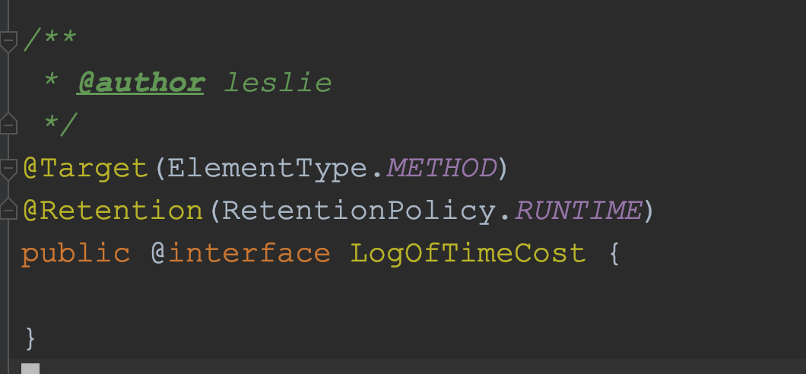

2. 注解的实现方法

   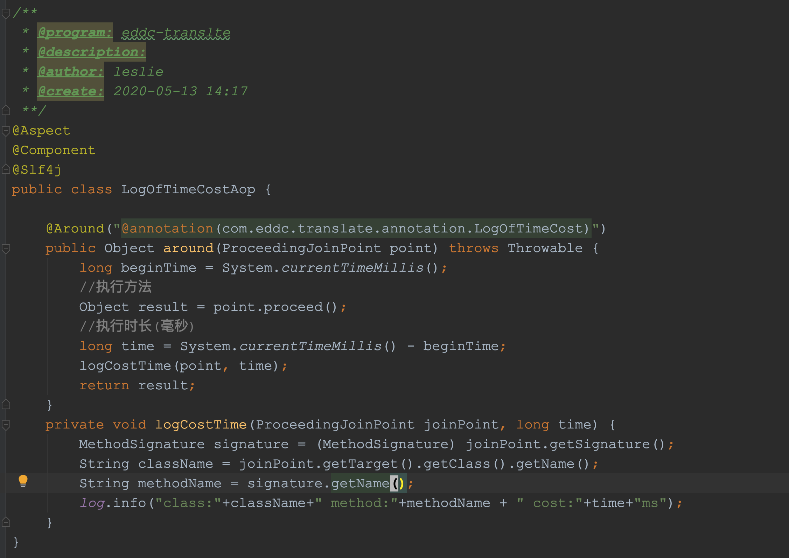

3. RedisConfig类，注入redis实例，重写序列化方法。用jdk默认的序列化可能出现存入数据库数据乱码。*important*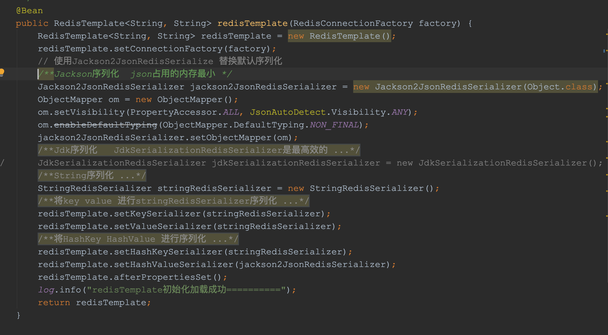

4. 翻译的入口方法，熔断的配置。熔断的fallback方法。当翻译超过insert到数据库阈值时候，唤醒线程去消费到数据库中

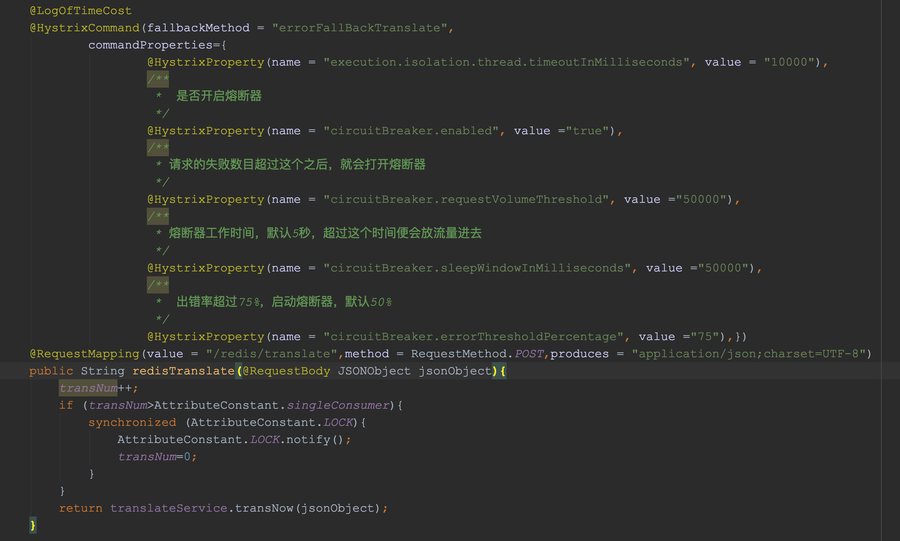

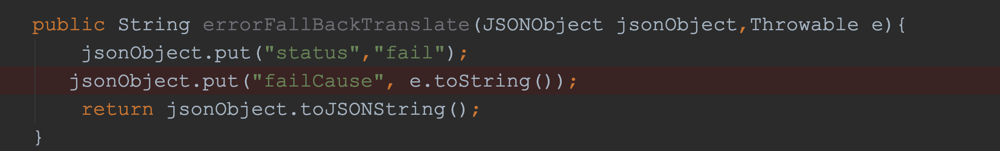

5. 存入mysql的存储介质，当存储介质中有一定数量时候，存入数据库

   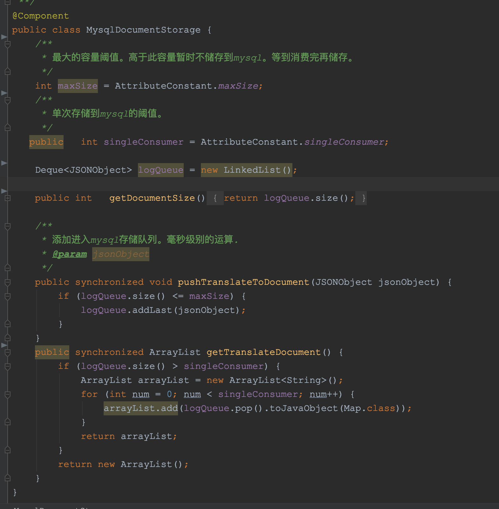

6. 多线程insert到数据库中

   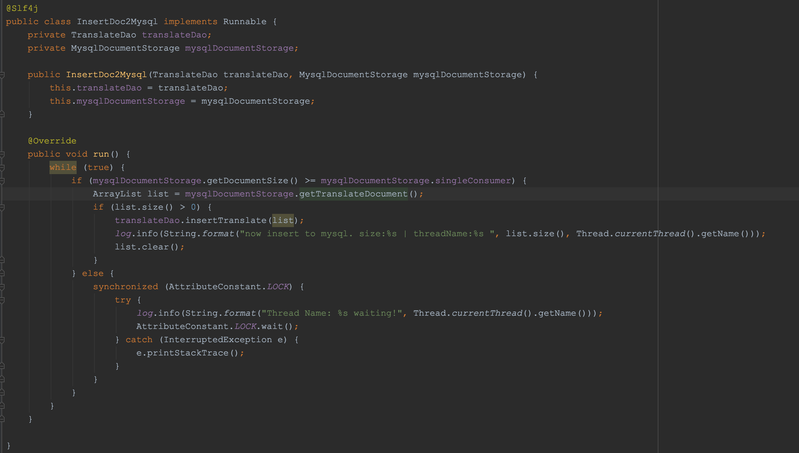

7. redis的实现类一些方法，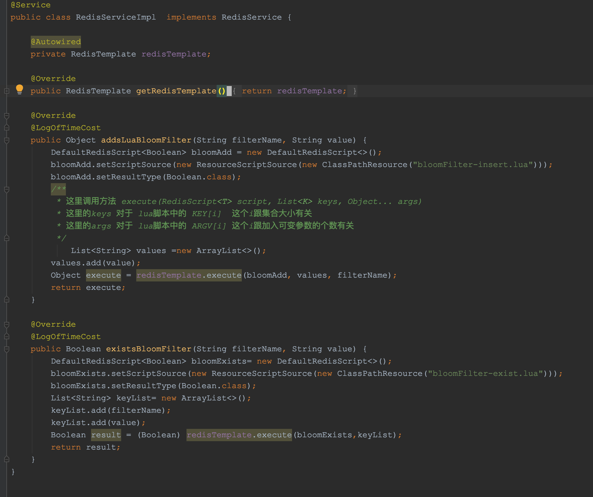

8. 翻译服务的具体方法

   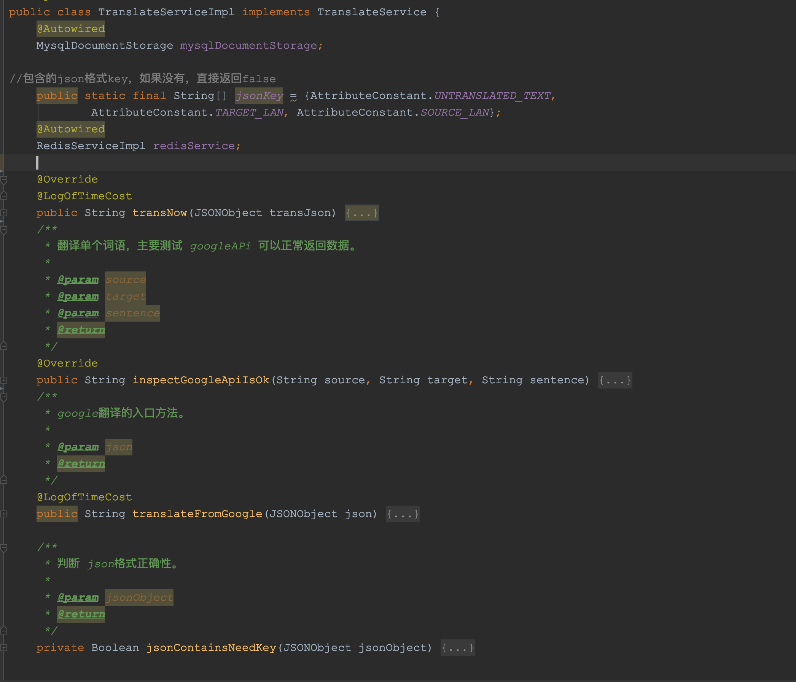

   

   * 翻译的逻辑方法，走redis,还是 google翻译

     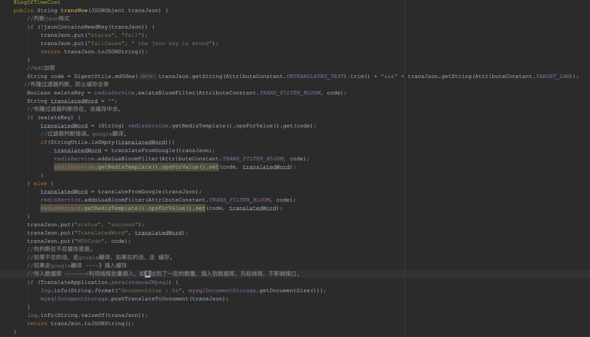

   * 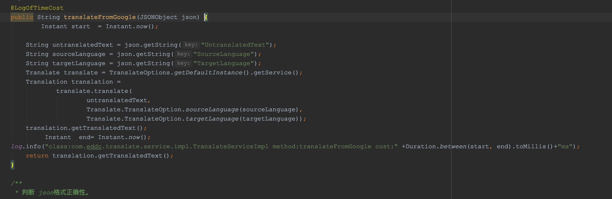

   * 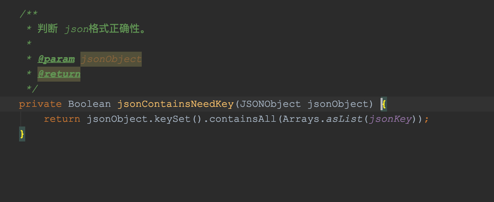

9. springboot 启动类

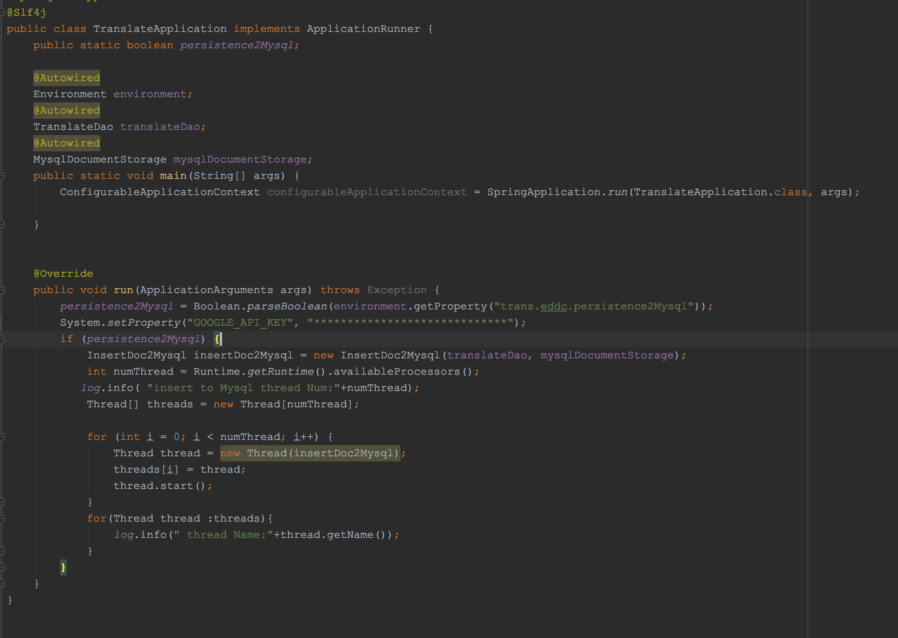

10. Logback.xml日志配置

    ```xml
    <?xml version="1.0" encoding="UTF-8"?>
    <configuration>
        <!-- 项目名称 -->
        <property name="projectname" value="translate" />
        <!-- 日志存放路径 -->
        <property name="log.path" value="./" />
    <!--
        <property name="log.path" value="/home/" />
    -->
        <!-- 日志输出格式 -->
        <property name="log.pattern" value="%d{yyy-MM-dd HH:mm:ss.SSS} [%X{X-B3-TraceId:-},%X{X-B3-SpanId:-}] [%thread] %-5level %logger{20} - [%method,%line] - %msg%n" />
    
        <!-- 控制台输出 -->
        <appender name="console" class="ch.qos.logback.core.ConsoleAppender">
            <encoder>
                <pattern>${log.pattern}</pattern>
            </encoder>
        </appender>
    
        <!-- 系统日志输出 -->
        <appender name="file_info" class="ch.qos.logback.core.rolling.RollingFileAppender">
            <file>${log.path}/${projectname}-info.log</file>
            <!-- 循环政策：基于时间创建日志文件 -->
            <rollingPolicy class="ch.qos.logback.core.rolling.TimeBasedRollingPolicy">
                <!-- 日志文件名格式 -->
                <fileNamePattern>${log.path}/${projectname}-info.%d{yyyy-MM-dd}.log</fileNamePattern>
                <!-- 日志最大的历史 60天 -->
                <maxHistory>60</maxHistory>
            </rollingPolicy>
            <encoder>
                <pattern>${log.pattern}</pattern>
            </encoder>
            <filter class="ch.qos.logback.classic.filter.LevelFilter">
                <!-- 过滤的级别 -->
                <level>INFO</level>
                <!-- 匹配时的操作：接收（记录） -->
                <onMatch>ACCEPT</onMatch>
                <!-- 不匹配时的操作：拒绝（不记录） -->
                <onMismatch>DENY</onMismatch>
            </filter>
        </appender>
    
        <appender name="file_error" class="ch.qos.logback.core.rolling.RollingFileAppender">
            <file>${log.path}/${projectname}-error.log</file>
            <!-- 循环政策：基于时间创建日志文件 -->
            <rollingPolicy class="ch.qos.logback.core.rolling.TimeBasedRollingPolicy">
                <!-- 日志文件名格式 -->
                <fileNamePattern>${log.path}/${projectname}-error.%d{yyyy-MM-dd}.log</fileNamePattern>
                <!-- 日志最大的历史 60天 -->
                <maxHistory>60</maxHistory>
            </rollingPolicy>
            <encoder>
                <pattern>${log.pattern}</pattern>
            </encoder>
            <filter class="ch.qos.logback.classic.filter.LevelFilter">
                <!-- 过滤的级别 -->
                <level>ERROR</level>
                <!-- 匹配时的操作：接收（记录） -->
                <onMatch>ACCEPT</onMatch>
                <!-- 不匹配时的操作：拒绝（不记录） -->
                <onMismatch>DENY</onMismatch>
            </filter>
        </appender>
    
    
        <!-- 系统模块日志级别控制  -->
        <logger name="com.loop" level="info" />
        <!-- Spring日志级别控制  -->
        <logger name="org.springframework" level="warn" />
    
        <root level="info">
            <appender-ref ref="console" />
        </root>
    
        <!--系统操作日志-->
        <root level="info">
            <appender-ref ref="file_info" />
            <appender-ref ref="file_error" />
        </root>
    
    </configuration>
    ```

    

    11. yml配置

```yaml
spring:
  application:
    name: translate
  datasource:
    url: jdbc:mysql://localhost:3306/translate?useUnicode=true&characterEncoding=UTF-8&useSSL=false
    username: root
    password: yecf123

  redis:
    host: localhost
    port: 6379
    #连接池最大连接数
    jedis:
      pool:
        max-active: 8
        #最小空闲连接
        min-idle: 0
        #最大阻塞等待时间，负值表示没有限制
        max-wait: -1
        #最大空闲连接
        max-idle: 8
    #连接超时时间(毫秒)
    timeout: 100
server:
  port: 9092
mybatis:
  mapper-locations: classpath:mapper/*.xml


trans:
  eddc:
    persistence2Mysql: true


hystrix:
  threadpool:
    default:
      coreSize: 10
      maxQueueSize: 1500
      queueSizeRejectionThreshold: 1000
```

12. bloomFilter-exist.lua

    ```lua
    local bloomName = KEYS[1]
    local value = KEYS[2]
    -- bloomFilter
    local result_1 = redis.call('BF.EXISTS', bloomName, value)
    return result_1
    ```

    

13. bloomFilter-insert.lua

```lua
-- 这里key 和 value切换了位置
local values = KEYS
local bloomName = ARGV[1]
local result_1
for k,v in ipairs(values) do
 result_1 = redis.call('BF.ADD',bloomName,v)
end
return result_1
```

