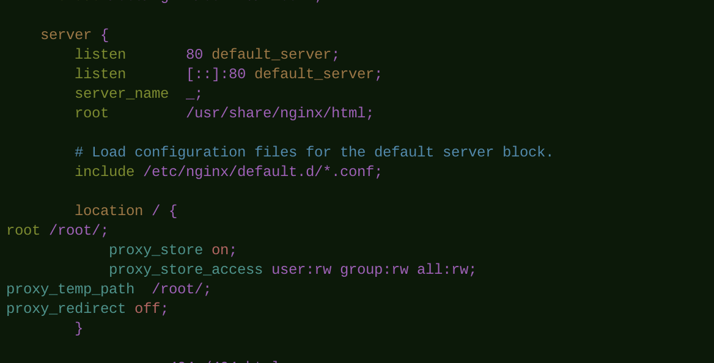

[参考](https://blog.51cto.com/12889016/2108818)

一   . 自己下载   nginx 并且编译 安装。 

 可以参考 ： https://blog.51cto.com/12889016/2108818

二  .对于版本没有要求。我一般都会用 yum安装。默认会下载 yum的 镜像源中的最新版本。

1. yum install  nginx    (   如果 找不到 nginx 镜像  ，执行 yum update ; yum upgrade;) 

2. whereis nginx  (查找安装位置。一般在  /etc/nginx/ 文件夹中)

3. cd    /etc/nginx/   文件夹

4. vim nginx.conf      编辑配置文件  

nginx 基本命令：

nginx -s reload  (nginx 重新启东)

nginx -s stop  (快速停止)

nginx -s quit （完整有序的停止）

ps -ef | grep nginx  （匹配停止）

kill -QUIT 主进程号   ：从容停止Nginx
kill -TERM 主进程号   ：快速停止Nginx
pkill -9 nginx     ：强制停止Nginx

加载对应nginx路径。不走默认路径

启动nginx:
nginx -c /path/to/nginx.conf