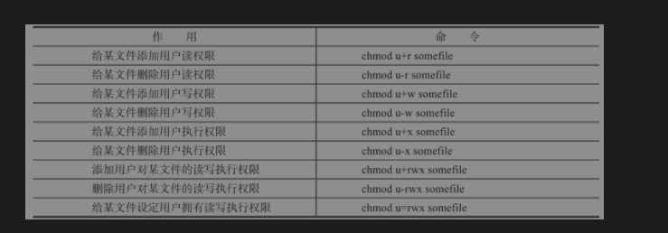
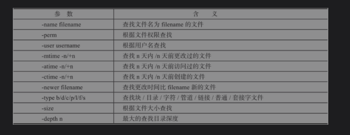

### 常用 命令

#  一、文件权限和目录


	### 1. chmod  (给文件赋权限)

 - 使用 u  g  o 分别代表拥有者，拥有组，其他人。

 - 对应的具体权限 用rwx来表示    

 - 增加权限用 + , 删除权限 -

 - 可以 ls -l 查看文件 的权限。 三个一组，分别代表了u,g,o

 - r =4, w =2,x=1。所以也可以通过赋数字来给与权限  chmod  777 somefile

   

   


### 2. chown  (改变文件的拥有者)

- 改变文件的拥有者为 leslie :         ```chown Leslie  a.txt```
- 改变文件的用户组:       ``` chown :Leslie   a.txt```
- 同时改变：                  ```chown Leslie:leslie a.txt ```

###  3. chgrp （改变文件的拥有组）

-   ```chgrp   Leslie   a.txt  ```
- 如果需要修改的是一个目录。那么需要 递归：     ```chgrp  -R  someDir```


###  **帮助文档可以参考 ：man  也可以安装 manpage-zh中文帮助文档**

[参考文档](https://www.cnblogs.com/wujinhong/p/7251376.html) 有帮助解决 ，安装 ，乱码问题。实测有效

### 4. 关于  SUID/SGID/STICKY ，默认权限和 umask,暂时不了解 

###  5. 查看文件类型：file

  * ```shell
    file  /root/
    ```


# 二 、查找文件

### 1. find （查找文件）

- ​	在某个路径下使用文件名匹配的方式查找文件 ：``` find path  -name   FILENAME```

  		* eg :  ```find / -name  a.txt```

  

* 模糊匹配
* 其他用法  ```man  find```



# 三、字符处理

- 1. 管道 ****
  2. grep
  3. uniq
  4. cut
  5. tr
  6. paste
  7. split

-  Sed |  awk | grep 三剑客 命令。很重要

  1. sed (stream editor) 

     1. **非交互式的流编辑器，通过多种转换修改流经它的文本。但是请注意，默认情况下，sed并不会改变原文件本身，而只是对流经sed命令的文本进行修改，并将修改后的结果打印到标准输出中（也就是屏幕）sed处理文本时是以行为单位的，每处理完一行就立即打印出来，然后再处理下一行，直至全文处理结束。sed可做的编辑动作包括删除、查找替换、添加、插入、从其他文件中读入数据等**

     2. **要想保存修改后的文件，必须使用重定向生成新的文件。如果想直接修改源文件本身则需要使用“-i”参数。一般不用，建议重定向，操作原文本不可逆**

     3. 处理文件类型：**常规编辑器编辑困难的文本。太过于庞大的文本，使用常规编辑器难以胜任（比如说vi一个几百兆的文件）。有规律的文本修改，加快文本处理速度（比如说全文替换）。为了演示sed的用法，首先准备如下文件**

        ​	i.  删除

        - 删除 文件的第一行 ``` sed '1d' a.txt```  

        -  删除文件1 到 三行   ```sed '1,3d' a.txt```

        - 删除到最后一行   ```sed '1,$d' a.txt```

        - 删除最后一行    ``` sed '$d'  a.txt```

        - 删除出了第五行之外  ``` sed '5!d' a.txt```

        - 删除空行 ```sed  '/^$/d' a.txt```

          

     

