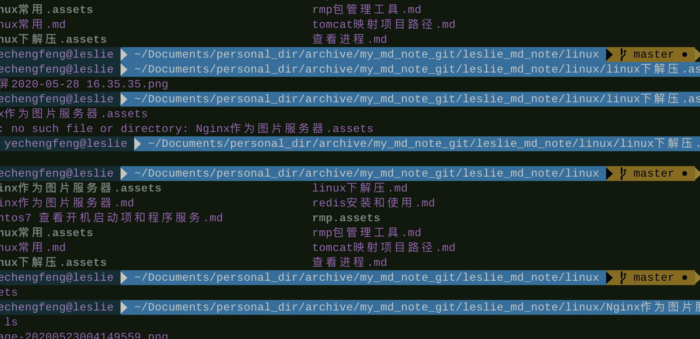

### 设计模式常用的七大原则 

------

- ###### 单一指责原则

- 接口隔离原则

- 依赖倒转原则

- 里式替换原则

- 开闭原则 （ocp）

- 迪米特法则

- (合成复用原则）

### 23种设计模式 

 相当于独孤九剑 ，所以肯定需要学的。

### 何时用到设计模式，为什么要用到设计模式

不是为了实现功能，而是为了可维护，可扩展，可读性，可靠性，高内聚，低耦合，重用性，优雅型。

